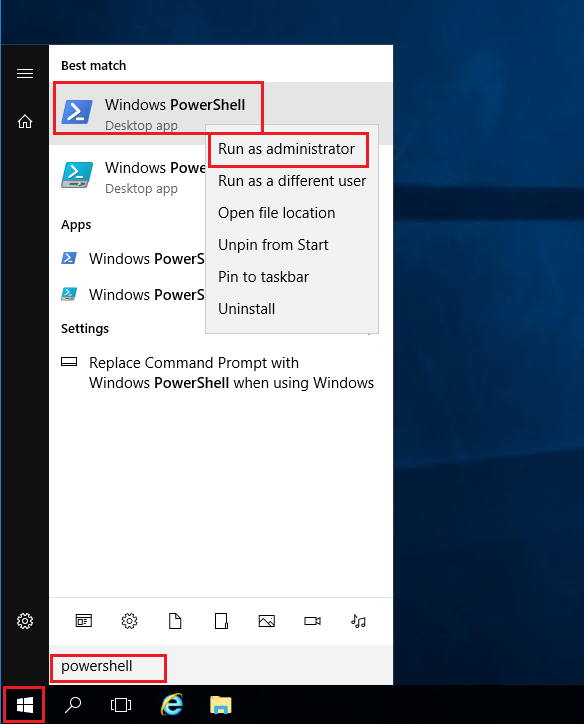

---
wts:
    title: '01 - Azure Portal에서 가상 머신 만들기'
    module: '모듈 02 - Azure 핵심 서비스'
---

# 01 - Azure 포털에서 가상 머신 만들기

이 연습에서는 Azure Portal 에서 Windows 가상 머신을 만들고 가상 머신에 연결한 후 웹 서버 역할을 설치하고 테스트 합니다.

실습 시간: 45 분

**메모**: 이 연습 과정 중 시간을 내어 정보 아이콘을 클릭하고 읽으십시오.

# 실습 1: 가상 머신 만들기

이 실습에서는 Windows Server 2016 Datacenter 가상 머신을 만듭니다. 

1. <a href="https://portal.azure.com" target="_blank"><span style="color: #0066cc;" color="#0066cc">Azure Portal</span></a>에 로그인 합니다.

2. 검색창에 **가상 머신**을 검색한 후 **+추가**를 클릭합니다.

3. 블레이드에 **기본 사항** 탭에서 다음을 이용하여 정보를 입력합니다. 명시되지 않은 정보는 기본 값으로 설정합니다.

	| 설정 | 값 |
	|---|---|
	| 구독 | **실습에 이용할 구독**|
	| 리소스 그룹 | **myRGVM** (새료 만들기) |
	| 가상 머신 이름 | **myVM* |
	| 지역 | **(아시아 태평양)아시아 남동부** |
	| 이미지 | **Windows Server 2016 Datacenter** |
	| 크기 | **표준 DS2 v2**|
	| 관리자 계정 사용자 이름 | **azureuser** |
	| 관리자 계정 암호 | **Pa$$w0rd1234**|
	| 인바운드 포트 규칙 - 인바운드 포트 선택 | **RDP (3389)** 와 **HTTP (80)**|
	|||

4. **관리** 탭으로 이동한 후 **모니터링** 영역에서 다음과 같이 설정합니다.

	| 설정 | 값 |
	|---|---|
	| 부트 진단 | **끄기**|
	|||

5. 나머지는 기본 값으로 두고 페이지 하단에서 **검토 + 만들기** 버튼을 클릭합니다.

6. 유효성 검사가 완료되면 **만들기**버튼을 클릭합니다. 가상 머신을 배포하는데 약 5~7분이 소요될 수 있습니다.

7. 배포 페이지 또는 **알람**아이콘(최상위 메뉴)에서 배포상태를 업데이트 받을 수 있습니다.

# 실습 2: 가상 머신에 연결

이 실습에서는 RDP(원격 데스크톱)를 사용하여 새로 만든 가상 머신에 연결합니다. 

1. 검색창에 새로 만든 **myVM**을 검색합니다.

**메모**: **알림**창에서 **리소스로 이동** 링크를 사용할 수도 있습니다.

2. 가상 머신의 **개요** 페이지에서 **연결**버튼을 클릭합니다.

    

    **메모**: 다음 설정은 Windows 컴퓨터에서 VM에 연결하는 방법에 대한 지침입니다. Mac에서는 Mac App Store에서 원격 데스크톱 클라이언트와 같은 RDP 클라이언트가 필요하며 Windows 가상 머신이 아닌 Linux 가상 머신을 만든 경우 `ssh`를 시용하여 bash Shell에서 직접 연결할 수 있습니다.

2. **가상 머신에 연결** 페이지에서 IP 주소와 포트 번호를 기본 설정으로 놔둔 후 **RDP 파일 다운로드**를 클릭합니다.

3. 다운로드 된 RDP 파일을 **열기**를 하고 **연결(N)**을 클릭합니다.

    

4. **Windows 보안** 창에서 **다른 옵션 선택**에 있는 **다른 계정 사용**을 선택합니다. 앞서 입력한 사용자 이름(.\azureuser)과 암호(Pa$$w0rd1234)를 입력한 후 **확인**버튼을 클릭하여 연결합니다.

    


5. 로그인 과정에서 인증서 경고가 표시 될 수 있습니다. **예**를 클릭하여 가상 머신에 연결합니다.

    

Azure에서 Windows Server 가상 머신을 배포하고 연결하는데 성공했습니다.

# 실습 3: 웹 서버 역할 설치 및 테스트

이 실습에서는 웹 서버 역할을 설치하고 IIS welcome 페이지가 정상적으로 뜨는지 확인합니다.

1. 연결된 가상 머신에서 PowerShell을 실행합니다. **시작** 버튼을 클릭하고 **PowerShell**을 검색한 후 Windows PowerShell에서 마우스 오른쪽 버튼을 클릭하여 **Run as administrator**를 선택합니다.

    

2. PowerShell 프롬프트에서 다음 명령어를 실행하여 가상 머신에 **Web-Server** 기능일 설치합니다. 이 명령어를 복사하여 붙여넣을 수 있습니다.

    ```PowerShell
    Install-WindowsFeature -name Web-Server -IncludeManagementTools
    ```
  
3. 설치가 완료되면 **Success** 설정이 **True**로 출력됩니다. 웹 서버 역할의 설치가 완료되었습니다. 가상 머신에 대한 RDP 연결을 닫습니다.

    

4. Azure Portal로 돌아와서 가상 머신을 선택하고 가상 머신의 **개요** 블레이드에서 **공용 IP 주소**에 나타나는 **클립보드로 복사**를 클릭하여 IP를 복사합니다.

    

5. 브라우저에 새로운 탭에서 복사한 IP로 연결하여 IIS welcome 페이지가 정상적으로 뜨는지 확인합니다.

    

이 IP 주소 또는 정규화 된 Domain name을 통해 어디서든 연결할 수 있는 웹서버를 구축하였습니다. 호스팅 할 웹페이지가 있는 경우 해당 소스파일을 가상 머신에 배포하고 배포 된 가상 머신에서 웹 서비스를 호스팅 할 수 있습니다.

**메모**: 추가 비용을 피하기 위해 리소스 그룹을 제거할 수 있습니다. 리소스 그룹(myRGVM)을 검색하고 리소스 그룹 블레이드에서 **Delete resource group**을 클릭한 후 삭제 창에 리소스 그룹 이름 입력란에 리소스 그룹 이름(myRGVM)을 입력합니다. 리소스 그룹 이름을 정확히 입력하면 하단에 **삭제** 버튼이 활성화 되며 삭제 버튼을 클릭하여 생성한 리소스들을 삭제합니다. **알람**에서 모니터링 할 수 있습니다.
