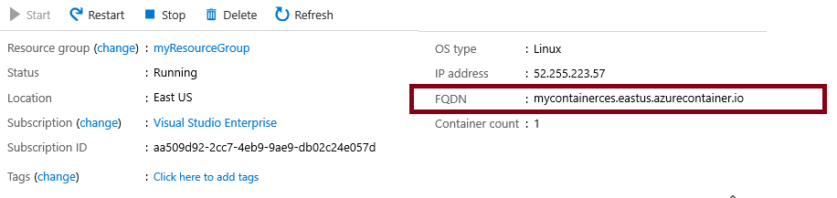

---
wts:
    title: '02 - Azure Container Instances 배포'
    module: '모듈 02 - Azure 핵심 서비스'
---

# 02 - Azure Container Instances 배포

이 연습에서는 Azure Portal에서 Azure Container Instances (ACI)에 Docker 컨테이너를 만들고, 설정하고 배포합니다. 컨테이너는 Welcome to ACI 정적 HTML 페이지를 표시하는 웹 응용프로그램 입니다. 

실습 시간: 20 분

# 실습 1: 컨테이너 인스턴스 만들기

이 실습에서는 웹 응용프로그램을 위한 새로운 컨테이너 인스턴스를 만듭니다.

1. <a href="https://portal.azure.com" target="_blank">Azure Portal</a>에 로그인 합니다.

2. 검색창에 **Container instances**를 검색한 후 **+추가**를 클릭합니다. 

3. 컨테이너 인스턴스 만들기 블레이드의 기본 사항 탭에서 다음을 이용하여 정보를 입력합니다. 명시되지 않은 정보는 기본 값으로 설정합니다.

	| 설정 | 값 |
	|----|----|
	| 구독 | **실습에 이용할 구독**|
	| 리소스 그룹 | **myRGContainer** (새로 만들기) |
	| 컨테이너 이름 | **mycontainer**|
	| 지역 | **(아시아 태평양)아시아 남동부** |
	| 이미지 형식 | **공용**|
	| 이미지 이름 | **microsoft/aci-helloworld**|
	| OS 유형 | **Linux** |
	|||

4. **네트워킹** 탭으로 이동한 후 다음과 같이 설정합니다.

	| 설정 | 값 |
	|----|----|
	| DNS 이름 레이블 | **mycontainerdnsxxx** (유니크 해야 함) |
	|||
	
	**메모**: 컨테이너는 dns-name-label.region.azurecontainer.io 라는 도메인으로 접근할 수 있습니다. **DNS name label not available** 애러 메세지가 표시되면 다른 DNS 이름 레이블을 지정하십시오.

	

5. 나머지는 기본 값으로 두고 페이지 하단에서 **검토 + 만들기** 버튼을 클릭합니다.

6. **만들기** 버튼을 클릭하여 컨테이너 인스턴스를 만듭니다.

7. 배포 페이지 또는 **알람**을 모니터링 합니다.

8. 기다리는 동안 [배포된 컨테이너의 샘플 코드](https://github.com/Azure-Samples/aci-helloworld)에 관심이 있다면 \app 폴더를 탐색합니다. 

# 실습 2: 배포된 컨테이너 확인

이 실습에서는 배포된 컨테이너 인스턴스 확인하고 시작 페이지가 표시되도록 합니다.

1. 배포가 완료되면 **리소스로 이동** 링크를 클릭합니다.

2. **개요** 블레이드에서 **상태**가 **실행 중**인지 확인합니다. 

3. FQDN(Fully Qualified Domain Name)을 찾습니다.

	

2. 컨테이너의 FQDN을 복사하여 웹 브라우저에 붙여넣어 시작 페이지가 표시되는지 확인합니다.

	

**메모**: 컨에티너 IP주소를 사용하여 확인할 수도 있습니다.

Azure Portal을 사용하여 Azure 컨테이너 인스턴스에 Welcome to ACI 정적 HTML 페이지를 표시하는 웹 응용프로그램 배포에 성공하였습니다.

**메모**: 추가 비용을 피하기 위해 리소스 그룹을 제거할 수 있습니다. 리소스 그룹(myRGContainer)을 검색하고 리소스 그룹 블레이드에서 **Delete resource group**을 클릭한 후 삭제 창에 리소스 그룹 이름 입력란에 리소스 그룹 이름(myRGContainer)을 입력합니다. 리소스 그룹 이름을 정확히 입력하면 하단에 **삭제** 버튼이 활성화 되며 삭제 버튼을 클릭하여 생성한 리소스들을 삭제합니다. **알람**에서 모니터링 할 수 있습니다.
