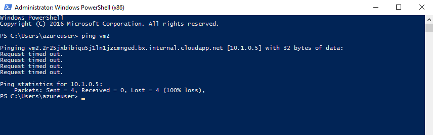
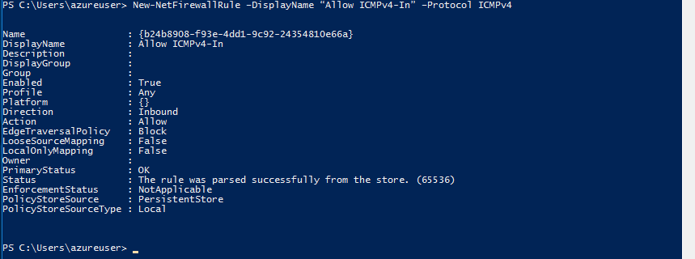

---
wts:
    title: '03 - 가상 네트워크 만들기'
    module: '모듈 02 - Azure 핵심 서비스'
---

# 03 - 가상 네트워크 만들기

이 연습에서는 가상 네트워크를 만들고 두 개의 가상 머신을 해당 가상 네트워크에 배포한 다음 하나의 가상 머신이 가상 네트워크를 통해 다른 가상 머신에게 ping 통신을 할 수 있도록 구성합니다.

실습 시간: 45 분

# 실습 1: 가상 네트워크 만들기

이 실습에서는 개로운 가상 네트워크를 만듭니다. 

1. <a href="https://portal.azure.com" target="_blank"><span style="color: #0066cc;" color="#0066cc">Azure Portal</span></a>에 로그인 합니다.

2. 검색창에 **가상 네트워크**를 검색한 후 **+추가**를 클릭합니다.

3. **가상 네트워크 만들기** 블레이드가 뜨면 다음을 이용하여 정보를 입력합니다. 명시되지 않은 정보는 기본 값으로 설정합니다.

    | 설정 | 값 | 
    | --- | --- |
    | 이름 | **vnet1** |
    | 주소 공간 | **10.1.0.0/16** |
    | 구독 | **실습에 이용할 구독**|
	| 리소스 그룹 | **myRGVNet** (새로 만들기) |
    | 위치 | **(아시아 태평양)아시아 남동부** |
    | 서브넷 이름 | **default** |
    | 서브넷 주소 범위 | **10.1.0.0/24** |
    | | |

4. **만들기** 버튼을 클릭하여 가상 네트워크를 배포합니다.

5. 조직에서 필요한 가상 네트워크의 IP 주소 공간을 어떻게 알 수 있습니까?

# 실습 2: 가상 머신 두개 배포

이 실습에서는 두 개의 가상 머신을 생성된 가상 네트워크에 배포합니다.

1. 검색창에 **가상 머신**을 검색한 후 **+추가**를 클릭합니다.

2. 가상 머신 만들기의 **기본 사항** 탭에서 다음을 이용하여 정보를 입력합니다. 명시되지 않은 정보는 기본 값으로 설정합니다.

    | 설정 | 값 |
    | --- | --- |
    | 구독 | **실습에 이용할 구독**|
    | 리소스 그룹 | **myRGVNet** |
    | 가상 머신 이름 | **vm1**|
    | 지역 | **(아시아 태평양)아시아 남동부** |
    | 이미지 | **Windows Server 2016 Datacenter** |
    | 크기 | **표준 DS2 v2**|
    | 관리자 계정 사용자 이름 | **azureuser** |
    | 관리자 계정 암호 | **Pa$$w0rd1234** |
    | 인바운드 포트 선택 | **RDP (3389)** |
    |||

3. **네트워킹** 탭을 선택하고 이전에 만든 vnet1이 선택되어 있는지 확인합니다. 기본 설정을 검토하되 수정하지 마세요.

    | 설정 | 값 |
    | --- | --- |
    | 가상 네트워크 | **vnet1** |
    |||

4. **검토 + 만들기**를 클릭합니다. 유효설 검사가 끝나면 **만들기** 버튼을 클릭하여 가상 머신을 배포합니다. 일반적으로 3-6분 정도 소요됩니다.

5. 가상 머신이 배포되길 기다리지 말고 두 번째 가상 머신을 배포합니다.

6. 다음에 명시된 부분을 참고하여 **2번 부터 4번** 단계를 반복하여 두번째 가상 머신을 배포합니다.

    | 설정 | 값 |
    | --- | --- |
    | 리소스 그룹 | **myRGVNet** |
    | 가상 머신 이름 |  **vm2** |
    | 가상 네트워크 | **vnet1** |
    |||

7. 두 개의 가상 머신의 배포가 완료될 때 까지 모니터링 합니다.

# 실습 3: 연결 테스트

이 실습에서는 ICMP 연결을 허용하고 가상 머신이 서로 ping 통신을 할 수 있는지 테스트 합니다.

1. **vm1**을 탐색하여 **상태**가 **실행 중**인지 확인합니다. 페이지를 새로고침 해야 할 수도 있습니다.

2. **개요** 블레이드에서 **연결** 버튼을 클릭합니다.

    **메모**: 실습이 원활하지 않다면 [01 - Azure Portal에서 가상 머신 만들기](https://microsoftlearningkoreanlab.github.io/AZ-900TKR-MicrosoftAzureFundamentals/Instructions/Walkthroughs/01-Create%20a%20virtual%20machine.html)를 먼저 수행해 보세요.

3. **가상 머신에 연결** 블레이드에서 **RDP 파일 다운로드** 버튼을 클릭하여 RDP 파일을 다운로드 한 후 가상 머신에 연결합니다.

4. **Windows 보안** 창에서 **다른 옵션 선택**을 클릭한 후 **다른 계정 사용**을 선택하고 앞서 입력한 사용자 이름(.\azureuser)과 암호(Pa$$w0rd1234)를 입력한 후 **확인**버튼을 클릭하여 연결합니다.

5. 연결된 가상 머신에서 **시작** 버튼을 클릭하고 **PowerShell**을 검색한 후 Windows PowerShell에서 마우스 오른쪽 버튼을 클릭하여 **Run as administrator**를 선택합니다.

7. 다음 명령어를 사용하여 vm2에 ping 연결을 시도합니다. 결과는 'Request timed out.'이 출력될 것입니다. `ping`은 **ICMP(Internet Control Message Protocol) 프로토콜**을 사용하며 Windows 방화벽의 기본 설정은 이를 차단합니다.

   ```PowerShell
   ping vm2
   ```
   
   

**이제 vm2에 연결하여 ICMP를 허용합니다.**

8. **2번 부터 4번** 단계를 반복하여 **vm2**에 RDP 연결을 합니다.

9. **PowerShell** 프롬프트를 실행하고 다음 명령어를 이용하여 Windows 방화벽에서 ICMP 통신을 허용합니다.

   ```PowerShell
   New-NetFirewallRule –DisplayName “Allow ICMPv4-In” –Protocol ICMPv4
   ```
    

**다시 vm1에 연결하여 ping 테스트를 시도합니다.**

10. vm1 원격 세션으로 돌아가서 ping 테스트를 다시 시도합니다. ping 테스트는 성공해야 합니다.

   ```PowerShell
   ping vm2
   ```

가상 네트워크에서 두 개의 가상 머신을 배포하고 하나의 가상 머신에서 다른 가상 머신에 ping 테스트를 할 수 있도록 구성하였습니다.

**메모**: 추가 비용을 피하기 위해 리소스 그룹을 제거할 수 있습니다. 리소스 그룹(myRGVNet)을 검색하고 리소스 그룹 블레이드에서 **Delete resource group**을 클릭한 후 삭제 창에 리소스 그룹 이름 입력란에 리소스 그룹 이름(myRGVNet)을 입력합니다. 리소스 그룹 이름을 정확히 입력하면 하단에 **삭제** 버튼이 활성화 되며 삭제 버튼을 클릭하여 생성한 리소스들을 삭제합니다. **알람**에서 모니터링 할 수 있습니다.
