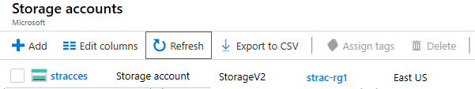
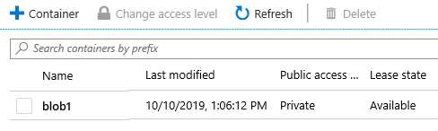
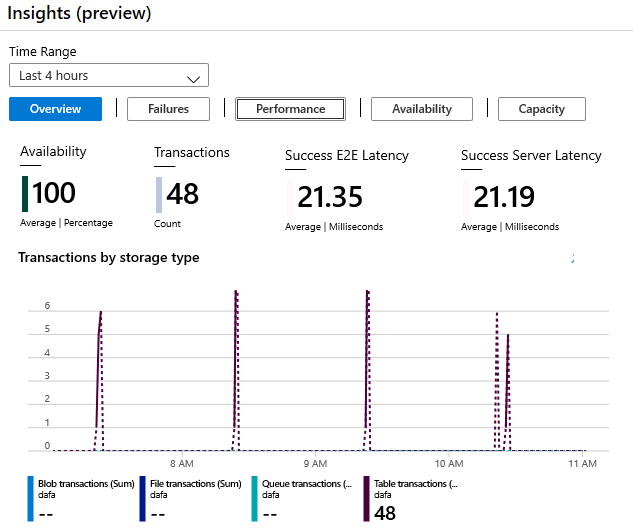

---
wts:
    title: '04 - Blob Storage 만들기'
    module: '모듈 02 - Azure 핵심 서비스'
---

# 04 - Blob Storage 만들기

이 연습에서는 스토리지 계정을 만든 다음 Blob Storage에 파일을 업로드 하여 작업합니다.

실습 시간: 25 분

# 실습 1: 스토리지 계정 만들기

이 실습에서는 스토리지 계정을 만듭니다.

1. <a href="https://portal.azure.com" target="_blank">Azure Portal</a>에 로그인 합니다.

2. 검색창에 **스토리지 계정**을 검색한 후 **+추가**를 클릭합니다.

3. 스토리지 계정 만들기 블레이드의 **기본 사항**탭이 뜨면 다음을 이용하여 정보를 입력합니다. 명시되지 않은 정보는 기본 값으로 설정합니다.

    | 설정 | 값 | 
    | --- | --- |
    | 구독 | **실습에 이용할 구독** |
	| 리소스 그룹 | **myRGStorage** (새로 만들기) |
    | 스토리지 계정 이름 | **storageaccountxxx** (유니크 해야 함) |
    | 위치 | **(아시아 태평양)아시아 남동부** |
    | 성능 | **표준** |
    | 계정 종류 | **StorageV2(범용 v2)** |
    | 복제 | **(LRS(로컬 중복 스토리지)** |
    | 액세스 계층 (기본값) | **핫** |
    | | |

5. **검토 + 만들기** 버튼을 클릭하여 스토리지 계정의 유효성 검사를 합니다.

6. 유효성 검사가 완료되면 **만들기** 버튼을 클릭하여 스토리지 계정을 생성합니다. **알람**에서 스토리지 계정의 생성이 완료될 때 까지 기다립니다.

7. **스토리지 계정**에서 새로 생성한 스토리지 계정이 보이는지 확인합니다.

    

# 실습 2: Blob Storage 작업

이 실습에서는 Blob 컨테이너를 만들고 Blob 파일을 업로드 합니다.

1. 새로 생성된 스토리지 계정을 클릭하고 **Blob Service** 영역에 **컨테이너**를 선택합니다.

2. Click **+ 컨테이너**를 클릭하고 다음을 이용하여 정보를 입력한 후 **확인**버튼을 클릭합니다.

    | 설정 | 값 |
    | --- | --- |
    | 이름 | **blob1**  |
    | 공용 액세스 수준 | **프라이빗(익명 액세스 없음)** |
    | | |

    

4. **blob1** 컨테이너를 선택하고 **업로드**를 클릭합니다.

5. Blob 업로드 창이 뜨면 폴더 모양의 아이콘을 클릭합니다. **열기** 창이 뜨면 로컬 컴퓨터에서 `.txt` 파일을 찾아 업로드 합니다. `.txt` 파일이 없는 경우 새로 생성합니다.

6. **고급** 화살표를 클릭하고 옵션을 확인한 후 기본 값을 그대로 둔 채 **업로드** 버튼을 클릭합니다.

    **메모**: 이 방법으로 여러 개의 blob을 업로드 할 수 있습니다.

7. 파일 업로드가 완료되면 마우스 오른쪽 버튼을 클릭하고 `보기/편집`, `다운로드`, `속성`등의 옵션을 확인합니다.

8. 시간이 있으면 스토리지 계정으로 돌아와 파일 서비스와 Table Service, 큐 서비스를 확인합니다.

# 실습 3: 스토리지 계정 모니터링

1. 스토리지 계정의 메인 페이지로 이동합니다.

2. **문제 진단 및 해결**을 클릭합니다.

3. 일반적인 스토리지 계정의 문제를 살펴봅니다. 문제 발생 시 이 가이드를 보고 해결할 수 있습니다.

4. **인사이트(미리보기)**를 클릭합니다. Failures, Performance, Availability, Capacity에 대한 정보를 확인할 수 있습니다.

    

스토리지 계정을 만든 다음 blob 저장소에 파일을 업로드 하였습니다.

**메모**: 추가 비용을 피하기 위해 리소스 그룹을 제거할 수 있습니다. 리소스 그룹(myRGStorage)을 검색하고 리소스 그룹 블레이드에서 **Delete resource group**을 클릭한 후 삭제 창에 리소스 그룹 이름 입력란에 리소스 그룹 이름(myRGStorage)을 입력합니다. 리소스 그룹 이름을 정확히 입력하면 하단에 **삭제** 버튼이 활성화 되며 삭제 버튼을 클릭하여 생성한 리소스들을 삭제합니다. **알람**에서 모니터링 할 수 있습니다.
