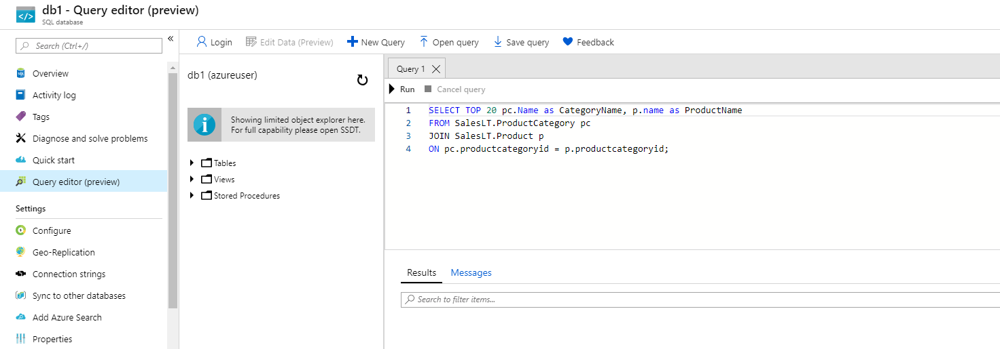

---
wts:
    title: '05 - SQL database 만들기'
    module: '모듈 02 - Azure 핵심 서비스'
---

# 05 - SQL database 만들기

이 연습에서는 Azure에서 SQL Database를 만든 다음 해당 데이터베이스의 데이터를 쿼리합니다.

실습 시간: 25 분

# 실습 1: Database 만들기

이 실습에서는 AdventureWorksLT 샘플 데이터베이스를 이용하여 새로운 SQL Database를 만듭니다.

1. <a href="https://portal.azure.com" target="_blank"><span style="color: #0066cc;" color="#0066cc">Azure Portal</span></a>에 로그인 합니다.

2. 검색창에 **SQL 데이터베이스**를 검색한 후 **+추가**를 클릭합니다.

3. SQL 데이터베이스 만들기의 **기본**탭이 뜨면 다음을 이용하여 정보를 입력합니다. 명시되지 않은 정보는 기본 값으로 설정합니다.

    | 설정 | 값 | 
    | --- | --- |
    | 구독 | **실습에 이용할 구독** |
    | 리소스 그룹 | **myRGDb** (새로 만들기) |
    | 데이터베이스 이름 | **db1** | 
    | | |

3. **서버**항목에서 **새로 만들기**를 클릭한 다음 다음을 이용하여 정보를 입력합니다. 입력이 완료된 후 **확인** 버튼을 클릭합니다.

    | 설정 | 값 | 
    | --- | --- |
    | 서버 이름 | **sqlserverxxx** (유니크 해야 함) | 
    | 서버 관리자 로그인 | **sqluser** |
    | 암호 | **Pa$$w0rd1234** |
    | 위치 | **(아시아 태평양)아시아 남동부** |
    | Azure 서비스의 서버 액세스 허용 | **체크** |
    | | |

   

4. **추가 설정** 탭으로 이동하여 데이터 원본 섹션에 다음과 같이 샘플 데이터베이스를 사용하도록 설정합니다.

    | 설정 | 값 | 
    | --- | --- |
    | 기존 데이터 사용 | **샘플** | 
    | | |

5. **검토 + 만들기** 버튼을 클릭한 후 **만들기** 버튼을 클릭하여 리소스 그룹, SQL 서버, SQL 데이터베이스를 배포합니다. 배포는 약 2-5분이 소요됩니다.

6. **알람**에서 배포를 모니터링 합니다.

# 실습 2: 데이터베이스 테스트

이 실습에서는 SQL Server를 구성하고 SQL 쿼리를 실행합니다.

1. **SQL 데이터베이스**를 탐색하여 새로 생성한 데이터베이스가 있는지 확인합니다. **새로 고침**을 해야 할 수도 있습니다.

    

2. 새로 생성한 **db1** SQL 데이터베이스를 클릭하고 **쿼리 편집기(미리 보기)**를 선택합니다.

3. 로그인에 **sqluser**와 암호에 **Pa$$w0rd1234**를 입력한 후 **확인** 버튼을 클릭합니다.

4. 로그인을 할 수 없다는 에러가 출력됩니다. 오류를 자세히 읽어 방화벽에서 허용해야 하는 IP를 기록해 둡니다.

    

5. **SQL servers**를 탐색하여 새로 생성한 SQL server가 있는지 확인합니다. 

    

6. 새로 생성한 SQL Server를 선택하고 **방화벽 및 가상 네트워크** 블레이드로 이동합니다.

7. **클라이언트 IP 추가**를 클릭하여 단말기의 공용 IP 주소를 추가하고 4번 오류에서 메모해둔 IP가 추가되었는지도 확인한다. 변경사항을 저장하기 위해 **저장**을 클릭합니다. 

    

8. SQL 데이터베이스에 있는 쿼리 편집기(미리 보기)의 로그인 페이지로 돌아갑니다. 로그인에 **sqluser**와 암호에 **Pa$$w0rd1234**를 입력하여 로그인을 다시 시도합니다. 이번엔 로그인이 성공합니다. 참고로 새 방화벽 규칙이 적용되는데 수 분이 소요될 수 있습니다. 

9. 성공적으로 로그인하면 쿼리 편집기가 나타납니다. 편집기 창에 다음 쿼리문을 입력합니다.

    ```SQL
    SELECT TOP 20 pc.Name as CategoryName, p.name as ProductName
    FROM SalesLT.ProductCategory pc
    JOIN SalesLT.Product p
    ON pc.productcategoryid = p.productcategoryid;
    ```

    

4. **실행**을 선택하고 **결과**패널을 검토합니다. 쿼리가 정상적으로 실행되었습니다.

    

Azure에서 SQL 데이터베이스를 만들고 해당 데이터베이스의 데이터를 성공적으로 쿼리했습니다.

**메모**: 추가 비용을 피하기 위해 리소스 그룹을 제거할 수 있습니다. 리소스 그룹(myRGDb)을 검색하고 리소스 그룹 블레이드에서 **Delete resource group**을 클릭한 후 삭제 창에 리소스 그룹 이름 입력란에 리소스 그룹 이름(myRGDb)을 입력합니다. 리소스 그룹 이름을 정확히 입력하면 하단에 **삭제** 버튼이 활성화 되며 삭제 버튼을 클릭하여 생성한 리소스들을 삭제합니다. **알람**에서 모니터링 할 수 있습니다.
