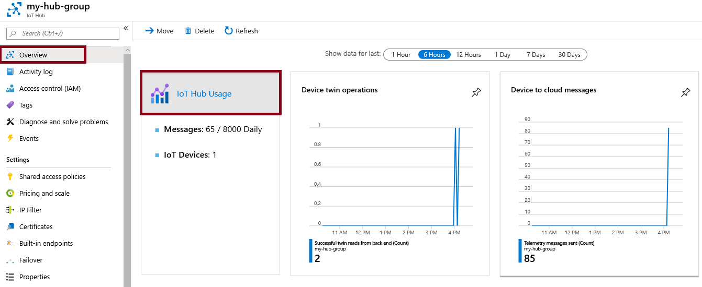

---
wts:
    title: '06 - Azure IoT Hub 구현'
    module: '모듈 02 - Azure 핵심 서비스'
---

# 06 - Azure IoT Hub 구현

이 연습에서는 Azure Portal에서 새로운 Azure IoT Hub를 구성한 다음 온라인 Raspberry Pi 시뮬레이터를 사용하여 IoT 디바이스에 인증을 사용하여 연결합니다. 센서 데이터 및 메시지는 Raspberry Pi 시뮬레이터에서 Azure IoT Hub로 전달되며 Azure Portal에서 메시징 활동에 대한 지표를 확인합니다.

실습 시간: 30 분

# 실습 1: IoT Hub 만들기 

이 실습에서는 IoT Hub를 만듭니다.

1. <a href="https://portal.azure.com" target="_blank">Azure Portal</a>에 로그인 합니다.

2. 검색창에 **IoT Hub**을 검색한 후 **+추가**를 클릭합니다.

3. IoT Hub 만들기 블레이드의 **기본 사항**탭이 뜨면 다음을 이용하여 정보를 입력합니다. 명시되지 않은 정보는 기본 값으로 설정합니다.

	| 설정 | 값 |
	|--|--|
	| 구독 | **실습에 이용할 구독** |
	| 리소스 그룹 |  **myRGIoT** (새로 만들기)|
	| 지역 | **아시아 남동부** |
	| IoT Hub 이름 | **myhubgroup** |
    | | |	

4. **크기 및 배율** 탭으로 이동하여 **가격 및 크기 계층**의 드롭 다운 메뉴를 클릭하고 **F1: 무료 계층**을 선택합니다. 하루에 고정된 수 만큼의 메시지를 처리합니다.

5. **검토 + 만들기** 버튼을 클릭합니다.

6. **만들기** 버튼을 클릭하여 새로운 IoT Hub를 만듭니다.

7. 배포가 완료될 때 까지 기다립니다.

# 실습 2: IoT 디바이스 추가

이 실습에서는 IoT 디바이스를 IoT Hub에 추가합니다.

1. **알람** 에서 **리소스로 이동** 버튼을 클릭하여 생성된 IoT Hub로 이동합니다. 검색창에 **IoT Hub**를 찾아도 됩니다.

	

2. 새로운 IoT 디바이스를 추가하려면 **IoT Hub 네비게이터**에서 **탐색기** 영역에 있는 **IoT 디바이스**를 선택합니다. **+새로 만들기**를 클릭합니다.

	

3. 새로운 IoT 디바이스 ID는 **myRaspberryPi**로 입력한 후 **저장** 버튼을 클릭합니다. 그러면 새로운 IoT 디바이스 ID를 생성됩니다.

4. 새로운 IoT 디바이스 ID가 보이지 않는다면 **새로 고침**을 클릭합니다.

5. **myRaspberryPi**를 선택하고 **기본 연결 문자열** 값을 복사합니다. 다음 실습에서 이 키를 사용하여 Raspberry Pi 시뮬레이터를 인증 합니다.

	

# 실습 3: Raspberry Pi 시뮬레이터를 사용하여 디바이스 테스트

이 실습에서는 Raspberry Pi 시뮬레이터를 사용하여 디바이스를 테스트 합니다. 

1. 웹 브라이저에서 [온라인 Raspberry Pi 시뮬레이터](https://azure-samples.github.io/raspberry-pi-web-simulator/#Getstarted)를 탐색합니다. 

2. Raspberry Pi 시뮬레이터 개요에 대해 읽어봅니다. Raspberry Pi 시뮬레이터에 대해 알고 있다면 "**X**"를 클릭하여 팝업창을 닫습니다.

3. 오른쪽 코딩 영역에서 'const connectionString ='이 있는 행을 찾아 **[Your IoT hub device connection string]**을 **기본 연결 문자열**로 수정합니다.

	const connectionString = '**기본 연결 문자열**'

	

4. 하단 패널에 있는 **Run**을 클릭하여 응용프로그램을 실행합니다. 콘솔 출력창에는 Raspberry Pi 시뮬레이터에서 Azure IoT Hub로 전송된 센서 데이터 및 메시지가 표시되어야 합니다. Raspberry Pi 시뮬레이터의 LED가 깜박일 때 마다 데이터와 메시지가 전송됩니다. 

	

5. **Stop**을 클릭하여 데이터 전송을 중단합니다.

6. Azure Portal에 있는 IoT Hub로 돌아갑니다.

7. IoT Hub의 **개요** 블레이드에서 스크롤을 내려 **IoT Hub 사용** 정보를 확인합니다.

	

**메모**: 추가 비용을 피하기 위해 리소스 그룹을 제거할 수 있습니다. 리소스 그룹(myRGIoT)을 검색하고 리소스 그룹 블레이드에서 **Delete resource group**을 클릭한 후 삭제 창에 리소스 그룹 이름 입력란에 리소스 그룹 이름(myRGIoT)을 입력합니다. 리소스 그룹 이름을 정확히 입력하면 하단에 **삭제** 버튼이 활성화 되며 삭제 버튼을 클릭하여 생성한 리소스들을 삭제합니다. **알람**에서 모니터링 할 수 있습니다.
