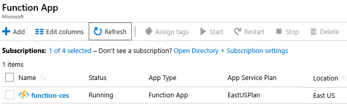
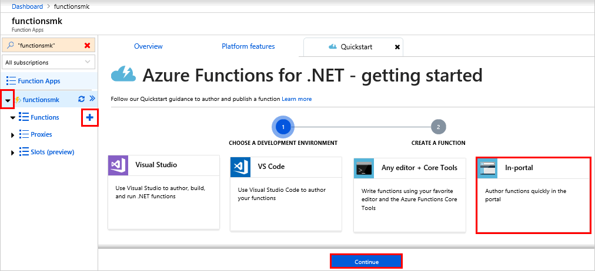
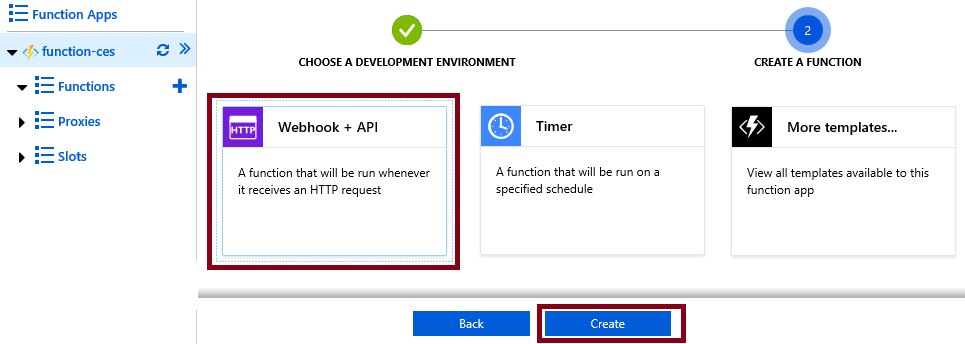
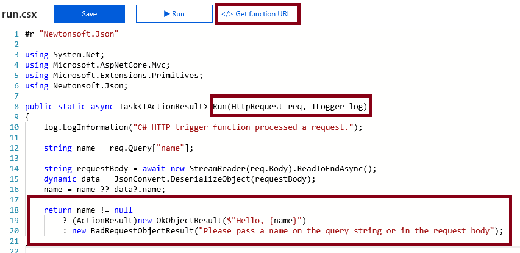
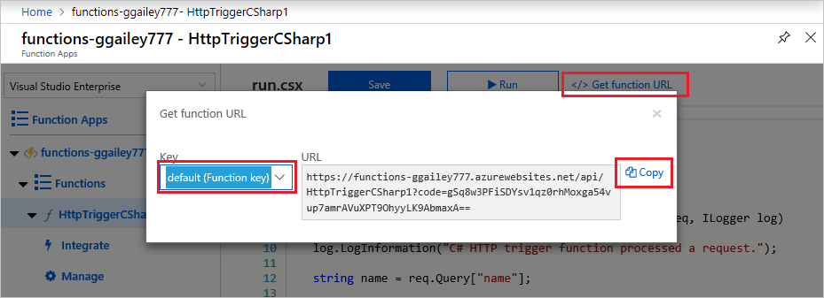
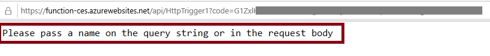
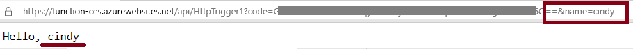
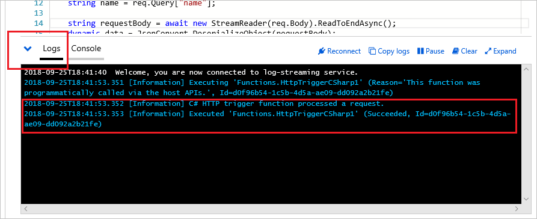

---
wts:
    title: '07 - Azure Functions 구현'
    module: '모듈 02 - Azure 핵심 서비스'
---

# 07 - Azure Functions 구현

이 연습에서는 HTTP 요청이 있을 때 Hello 메시지를 표시하는 함수 앱을 만듭니다.

실습 시간: 30 분

# 실습 1: 함수 앱 만들기

이 실습에서는 Fnction app을 만듭니다.

1. <a href="https://portal.azure.com" target="_blank">Azure Portal</a>에 로그인 합니다.

2. 검색창에 **함수 앱**을 검색한 후 **+추가**를 클릭합니다.

3. 함수 앱 만들기 블레이드의 **기본** 탭이 뜨면 다음을 이용하여 정보를 입력합니다.

    | 설정 | 값 |
    | -- | --|
    | 구독 | **실습에 이용할 구독** |
	| 리소스 그룹 | **myRGFunction** (새로 만들기) |
    | 함수 앱 이름 | **function-xxx** (유니크 해야 함) |
    | 게시 | **코드** |
    | 런타임 스택 | **.Net Core** |
    | 지역 | **Southeast Asia** |
    | | |	

4. **호스팅** 탭으로  이동한 후 다음과 같이 설정합니다.

	| 설정 | 값 |
	|----|----|
	| 운영 체제 | **Windows** |
    | 계획의 플랜 유형 | **소비** |
	|||

5. **검토 + 만들기** 버튼을 클릭하여 함수 앱의 유효성 검사를 합니다.

6. 유효성 검사가 완료되면 **만들기** 버튼을 클릭하여 함수 앱을 생성합니다. **알람**에서 함수 앱의 생성을 모니터링 합니다.

6. 함수 앱에서 새로운 리소스의 상태가 *실행 중*인지 확인합니다. 

    

# 실습 2: HTTP 트리거를 갖는 함수 생성과 테스트

이 실습은 Webhook + API 함수를 사용하여 HTTP 요청이 있을 때 메시지를 표시합니다.

1. 새로운 함수 앱을 선택합니다.

2. 함수 오른쪽에 "**+**" 버튼을 클릭하고 **포털 내**를 선택합니다. Visual Studio나 VS Code를 사용할 수 있습니다. **계속** 버튼을 클릭합니다.

    

3. **WebHook + API**를 선택하고 **만들기** 버튼을 클릭합니다. 이 설정은 앱이 HTTP 요청을 받을 때마다 함수가 실행됩니다. 

    

4. 이 코드는 HTTP 요청이 실행되고 로그를 남기도록 설계되었습니다. 함수는 이름과 함께 Hello 메시지를 반환합니다. 

    

5. 함수 편집기의 상단에 있는 **</> 함수 URL 가져오기**를 클릭합니다.

6. **키** 드롭 다운 메뉴의 값을 **default (Function key)**으로 설정하고 **복사** 버튼을 클릭하여 함수 URL을 복사합니다.

    

7. 복사한 URL을 웹 브라우저의 주소창에 붙여넣습니다. 페이지가 요청되면서 함수가 실행되며 이 함수에는 이름이 필요하다는 메시지가 출력됩니다.

    

8. URL의 끝에 **&name=yourname**을 추가합니다.

    **메모**: 여기서 `<yourname>`에는 사용자의 이름을 넣어보세요. 예를 들어 이름이 Cindy라면 이런 URL이 됩니다. `https://azfuncxxx.azurewebsites.net/api/HttpTrigger1?code=X9xx9999xXXXXX9x9xxxXX==&name=cindy`

    

9. 함수가 실행되면 실행된 정보가 Azure에 로그 파일로 작성됩니다. 로그를 보려면 Azure Portal의 함수 편집기로 돌아가서 **로그** 버튼을 클릭합니다.

    

HTTP 요청이있을 때 Hello 메시지를 표시하는 함수 앱을 작성했습니다.

**메모**: 추가 비용을 피하기 위해 리소스 그룹을 제거할 수 있습니다. 리소스 그룹(myRGFunction)을 검색하고 리소스 그룹 블레이드에서 **Delete resource group**을 클릭한 후 삭제 창에 리소스 그룹 이름 입력란에 리소스 그룹 이름(myRGFunction)을 입력합니다. 리소스 그룹 이름을 정확히 입력하면 하단에 **삭제** 버튼이 활성화 되며 삭제 버튼을 클릭하여 생성한 리소스들을 삭제합니다. **알람**에서 모니터링 할 수 있습니다.
