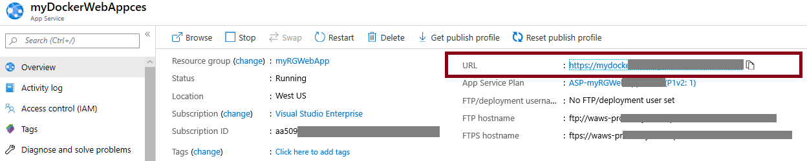

---
wts:
    title: '08 - Web App 만들기'
    module: '모듈 02 - Azure 핵심 서비스'
---

# 08 - Web App 만들기

이 연습에서는 Docker 컨테이너를 실행하는 Web App을 만듭니다.

실습 시간: 25 분 

# 실습 1: Web App 만들기

Azure App Service는 실제로 4개의 서비스 모음으로, 웹 서비스를 호스팅하고 실행하는 데 도움이 됩니다. 네 가지 서비스 (Web Apps, Mobile Apps, API Apps 및 Logic Apps)는 다르게 보이지만 모두 유사한 방식으로 작동합니다. Web App은 네 가지 서비스 중 가장 일반적으로 사용되며 이 연습에서 사용할 서비스입니다.

이 실습에서는 Azure App Service Web App을 만듭니다. 

1. <a href="https://portal.azure.com" target="_blank">Azure Portal</a>에 로그인 합니다.

2. 검색창에 **App Services**을 검색합니다.

3. **+추가**를 클릭하여 Web App을 생성합니다. 다음을 이용하여 정보를 입력합니다. 명시되지 않은 정보는 기본 값으로 설정합니다.

    | 설정 | 값 |
    | -- | -- |
    | 구독 | **실습에 이용할 구독** |
	| 리소스 그룹 | **myRGWebApp1** (새로 만들기) |
    | 이름 | **myDockerWebAppxxx** (유니크 해야 함) |
    | 게시 | **Docker 컨테이너** |
    | 운영 체제 | **Linux** |
    | 지역 | **Southeast Asia** (모든 서비스 계획 가용성 경고 무시) |
    | | |	

4. **다음 > Docker**를 클릭하고 컨테이너 정보를 구성합니다. 시작 명령은 옵션이며 이 실습에서는 필요하지 않습니다.

    **메모**: 이 컨테이너는 컨테이너 인스턴스에서 사용된 것과 동일한 컨테이너 입니다.

    | 설정 | 값 |
    | -- | -- |
    | 옵션 | **단일 컨테이너** |
    | 이미지 소스 | **Docker Hub** |
    | 액세스 형식 | **공개** |
    | 이미지 및 태그 | **microsoft/aci-helloworld** |
    | | |	

5. **검토 + 만들기**를 클릭하고 유효성 검사가 끝나면 **만들기** 버튼을 클릭하여 Web App을 생성합니다.

# 실습 2: Web App 테스트

이 실습에서는 Web App을 테스트합니다.

1. Web App이 배포가 완료될 때 까지 기다립니다.

2. **알람**에서 **리소스로 이동** 버튼을 클릭합니다.

3. **개요** 블레이드에서 **URL**을 찾습니다.

    

4. **URL**을 클릭하면 Docker 컨테이너가 실행되고 Azure 컨테이너 인스턴스 페이지가 표시됩니다.

    

5. Web App의 **개요** 블레이드에 여러개의 차트가 있습니다. URL을 몇번 실행하면 액세스 정보를 볼 수 있습니다. 여기에는 요청 수와 평균 응답시간이 포함됩니다.

**메모**: 추가 비용을 피하기 위해 리소스 그룹을 제거할 수 있습니다. 리소스 그룹(myRGWebApp1)을 검색하고 리소스 그룹 블레이드에서 **Delete resource group**을 클릭한 후 삭제 창에 리소스 그룹 이름 입력란에 리소스 그룹 이름(myRGWebApp1)을 입력합니다. 리소스 그룹 이름을 정확히 입력하면 하단에 **삭제** 버튼이 활성화 되며 삭제 버튼을 클릭하여 생성한 리소스들을 삭제합니다. **알람**에서 모니터링 할 수 있습니다.
