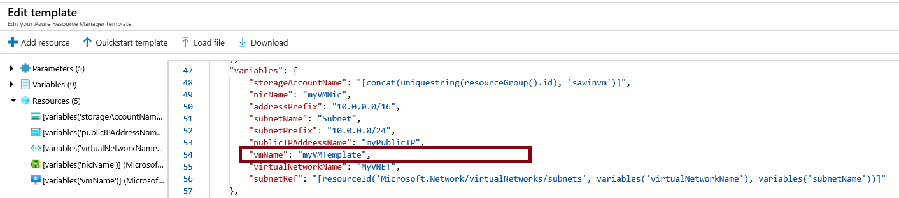

---
wts:
    title: '09 - 템플릿으로 VM 만들기'
    module: '모듈 02 - Azure 핵심 서비스'
---

# 09 - 템플릿으로 VM 만들기

이 연습에서는 Quick start template로 가상 머신을 배포하고 모니터링 기능을 확인합니다.

실습 시간: 30 분

# 실습 1: 갤러리에서 템플릿 찾기

이 실습에서는 Azure QuickStart 템플릿 갤러리에서 템플릿을 배포하여 가상 머신을 만듭니다.

1. 브라우저에서 <a href="https://azure.microsoft.com/resources/templates?azure-portal=true" target="_blank">Azure Quickstart 템플릿 갤러리</a>를 탐색합니다. 갤러리에는 자주 쓰이고 최근 업데이트 된 많은 템플릿들이 있습니다. 이 템플릿은 Azure 리소스와 널리 사용되는 소프트웨어 패키지에서 작동합니다.

2. 사용 가능한 다양한 템플릿들 중 관심 있는 템플릿이 있는지 둘러봅니다. 

3. <a href="https://azure.microsoft.com/resources/templates/101-vm-simple-windows?azure-portal=true" target="_blank">Deploy a simple Windows VM</a> 템플릿을 검색하거나 링크를 클릭하여 직접 접근합니다.

    **메모**: **Azure에 배포** 버튼을 사용하면 템플릿을 Azure에 직접 배포할 수 있습니다. 이 템플릿은 적은 매개변수를 요구합니다.

4. **Azure에 배포** 버튼을 클릭합니다.

5. **템플릿 편집**을 클릭합니다. Resource Manager 템플릿은 JSON 형식입니다. 매개 변수를 살펴보고 vmName을 찾습니다. 이름을 **myVMTemplate**으로 변경하고 **저장** 버튼을 눌러 변경사항을 수정합니다.

    

6. 다음을 이용하여 템플릿 매개변수를 입력합니다.

	| 설정 | 값 |
	|--|--|
	| 구독 | **실습에 이용할 구독** |
	| 리소스 그룹 | **myRGTemplate** (새로 만들기) |
	| 위치 | **(아시아 태평양)아시아 남동부** |
    | Admin Username | **azureuser** |
    | Admin Password | **Pa$$w0rd1234** |
    | DNS label prefix | **myvmtemplatexxx** (유니크 해야 함) |
    | Windows OS version | **2016-Datacenter** |
   	| | |

7. **위에 명시된 사용 약관에 동의함** 체크박스에 체크한 후 **구매** 버튼을 클릭합니다.

    **메모**: 이 템플릿과 관련된 비용은 없습니다.

8. 배포를 모니터링 합니다.

# 실습 2: 가상 머신 배포 확인과 모니터링

이 실습에서는 가상 머신이 올바르게 배포 되었는지 확인합니다.

1. 검색창에 **가상 머신**을 검색합니다.

2. 새로운 가상 머신이 배포되었는지 확인합니다.

    

3. 가상 머신을 선택하여 **개요** 블레이드에서 아래로 스크롤하여 모니터링 데이터를 확인합니다.

4. 기간은 1시간에서 30일로 조정할 수 있습니다.

5. **CPU(평균)**, **네트워크(합계)**, **디스크 바이트(합계)**를 포함한 다른 차트들을 확인합니다. 

    

6. 아무 차트나 클릭하고 메트릭 블레이드가 뜨면 **메트릭 추가**를 클릭하여 메트릭을 추가해보고 오른쪽 위에 있는 시간 범위도 변경해 봅니다.

7. **개요** 블레이드로 돌아옵니다.

8. 왼쪽 패널에서 **활동 로그**를 클릭합니다. 활동 로그는 리소스를 만들거나 수정할 때 기록됩니다.

9. **필터 추가**를 클릭하고 어떤 종류의 필터를 제공하는지 확인하고 검색해 봅니다.

    

**메모**: 추가 비용을 피하기 위해 리소스 그룹을 제거할 수 있습니다. 리소스 그룹(myRGTemplate)을 검색하고 리소스 그룹 블레이드에서 **Delete resource group**을 클릭한 후 삭제 창에 리소스 그룹 이름 입력란에 리소스 그룹 이름(myRGTemplate)을 입력합니다. 리소스 그룹 이름을 정확히 입력하면 하단에 **삭제** 버튼이 활성화 되며 삭제 버튼을 클릭하여 생성한 리소스들을 삭제합니다. **알람**에서 모니터링 할 수 있습니다.
