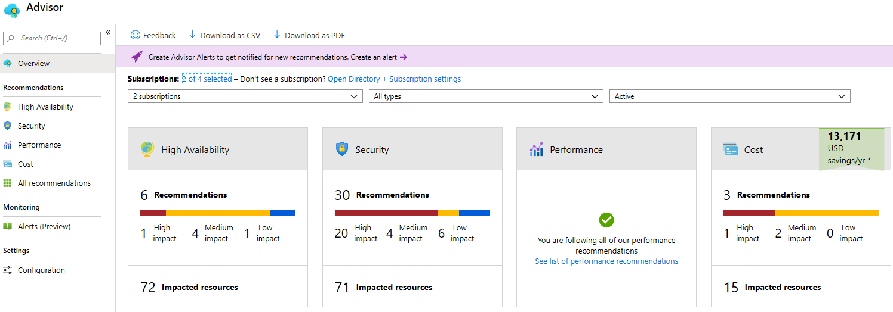
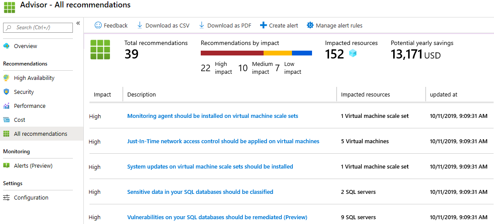

---
wts:
    title: '10 - PowerShell로 VM 만들기'
    module: '모듈 02 - Azure 핵심 서비스'
---

# 10 - PowerShell로 VM 만들기

이 연습에서는 PowerShell을 로컬 컴퓨터에 설치하고 리소스 그룹과 가상 머신을 만들고 Cloud Shell에서 PowerShell을 사용해봅니다. 그리고 Azure Advisor 권장 사항을 확인합니다.

실습 시간: 35 분

# 실습 1: PowerShell 설정하기

이 실습에서는 로컬 컴퓨터에 PowerShell이 실행 되도록 구성합니다.

1. 로컬 컴퓨터의 작업 표시줄에서 **시작** 버튼을 클릭하여 **PowerShell**을 입력합니다. 검색된 응용프로그램 중 **Windows PowerShell**을 찾아 마우스 오른쪽 버튼을 클릭한 후 **관리자 권한으로 실행**을 클릭합니다. 사용자 계정 컨트롤 팝업이 뜨면 **예** 버튼을 클릭하여 PowerShell을 관리자 권한으로 실행합니다.

    **메모**: Linux 또는 MacOS의 경우 다음 명령어를 사용하여 관리자 권한으로 PowerShell Core를 실행할 수 있습니다. PowerShell Core가 설치되어있지 않다면 <a href="https://docs.microsoft.com/en-us/powershell/scripting/install/installing-powershell?view=powershell-6" target="_blank"><span style="color: #0066cc;" color="#0066cc">여기</span></a>를 참고하시기 바랍니다.
    

    ```bash
    sudo pwsh
    ```

2. PowerShell 프롬프트에서 Azure PowerShell 모듈을 설치합니다. 메시지가 표시되면 **Yes to All**로 응답하여 원격 저장소를 신뢰합니다. 설치가 완료되는데 몇 분이 소요될 수 있습니다.

    ```PowerShell
    Install-Module Az -AllowClobber
    ```

    **메모**: 프롬프트가 표시되면 Windows 사용자는 *NuGet* 패키지 제공자 설치에 동의하고 *PowerShell Gallery*(PSGallery)에서 모듈 설치에 동의해야 합니다. 스크립트 실행 실패가 발생하면 `Set-ExecutionPolicy RemoteSigned` cmdlet을 실행하세요.

3. 최신 Az 모듈로 업데이트 받습니다.

    ```PowerShell
    Update-Module -Name Az
    ```

    **메모**: 프롬프트가 표시되면 **Yes to All**로 응답하여 Az 모듈에 대한 업데이트를 신뢰합니다. 최신 버전의 Az 모듈이 이미 설치되어 있으면 프림프트가 자동으로 반환합니다.

# 실습 2: 리소스 그룹과 가상 머신 생성

이 실습에서는 PowerShell을 사용하여 리소스 그룹과 가상 머신을 생성합니다.

1. 로컬 컴퓨터의 PowerSell 프롬프트에서 Azure에 연결하고 사용자 계정 로그인 창이 뜨면 Azure 로그인 자격 증명을 입력합니다. 로그인 완료 후 출력되는 구독 및 계정 정보를 확인합니다.

    ```PowerShell
    Connect-AzAccount
    ```

    **메모**: Azure 구독이 두개 이상인 경우 출력된 구독 및 계정 정보가 실습에 사용할 구독이 **아닐 수** 있습니다. 이련 경우 다음 명령어를 사용하여 명시적으로 구독을 선택해야 합니다.
    
    ```PowerShell
    Select-AzSubscription -Subscription <구독 ID>
    ```

2. 새로운 리소스 그룹을 생성합니다.

    ```PowerShell
    New-AzResourceGroup -Name myRGPS -Location SoutheastAsia
    ```

3. 새로 생성한 리소스 그룹을 확인합니다.

    ```PowerShell
    Get-AzResourceGroup | Format-Table
    ```

4. 다음 명령어를 사용하여 가상 머신을 생성합니다. 실행 후 가상 머신의 관리자 계정 정보인 username(**azureuser**)과 password(**Pa$$w0rd1234**)를 제공합니다. 이 명령어는 한줄로 입력되어야 합니다. 그레이브(`)은 한 줄로 이루어진 명령어를 보기 쉽게 줄바꿈을 할 때 사용합니다.

    ```PowerShell
    New-AzVm `
    -ResourceGroupName "myRGPS" `
    -Name "myVMPS" `
    -Location "SoutheastAsia" `
    -VirtualNetworkName "myVnetPS" `
    -SubnetName "mySubnetPS" `
    -SecurityGroupName "myNSGPS" `
    -PublicIpAddressName "myPublicIpPS"
    ```

5. <a href="https://portal.azure.com" target="_blank"><span style="color: #0066cc;" color="#0066cc">Azure Portal</span></a>에 로그인 합니다.

6. 검색창에 **가상 머신**을 검색한 후 **myVMPS**가 실행 중인지 확인합니다. 가상 머신 배포작업은 수 분이 걸립니다.

    

7. 새로운 가상 머신에 액세스 하고 **개요**와 **네트워킹** 설정을 검토하여 설정한 정보가 올바른지 확인합니다.

8. PowerShell 세션을 닫습니다.

# 실습 3: Cloud Shell에서 명령 실행

이 실습에서는 Cloud Shell에서 PowerShell 명령어를 실행합니다.

1. Azure Portal에서 오른쪽 상단에 있는 **>_** 아이콘을 클릭하여 **Azure Cloud Shell**을 실행합니다.

    

2. Cloud Shell을 이전에 사용했을 경우 4단계로 건너 뜁니다.

3. 메시지가 표시되면 구독에서 **실습에 이용할 구독**을 선택한 후 **스토리지 만들기**버튼을 클릭하여 Cloud Shell을 초기화 합니다.

4. 왼쪽 상단 드롭 다운 메뉴에서 **PowerShell**이 선택되어 있는지 확인합니다. PowerShell이 선택되어있지 않다면 드롭 다운 메뉴를 클릭하여 **PowerShell**로 수정하고 **Cloud Shell의 PowerShell 전환**창이 뜨면 **확인** 버튼을 눌러 PowerShell로 변경합니다.

    **메모**: Azure 구독이 두개 이상인 경우 다음 명령어를 사용하여 명시적으로 구독을 선택해야 합니다.
    
    ```PowerShell
    Select-AzSubscription -Subscription <구독 ID>
    ```

5. 다음 명령어를 사용하여 가상 머신의 name, resource group, location, status를 확인합니다. PowerState는 **running**입니다.

    ```PowerShell
    Get-AzVM -name myVMPS -status | Format-Table -autosize
    ```

6. 가상 머신을 중지합니다. 프롬프트가 뜨면 **Yes**를 선택합니다.

    ```PowerShell
    Stop-AzVM -ResourceGroupName myRGPS -Name myVMPS
    ```

7. 다음 명령어를 이용하여 가상 머신의 상태를 확인합니다. PowerState가 **deallocated**로 되어있는지 확인합니다. 이는 Azure Portal 에서도 확인할 수 있습니다.

    ```PowerShell
    Get-AzVM -name myVMPS -status | Format-Table -autosize
    ```

# 실습 4: Azure Advisor 권장 사항 검토

**메모**: Azure CLI를 사용하여 VM 만들기에 동일한 작업이 있습니다.

이 실습에서는 가상 머신에 대한 Azure Advisor 권장 사항을 검토합니다.

1. Azure Portal에서 **Advisor**를 검색합니다.

2. Advisor에서 **개요**를 선택합니다. 권장 사항은 고 가용성, 보안, 성능, 뛰어난 운영, 비용으로 그룹화됩니다.

    

3. **모든 권장 사항**을 클릭하고 제안된 권장사항과 정보를 확인합니다.

    **메모**: 리소스에 따라 권장 사항이 달라집니다. 

    

4. 권장 사항을 CSV 또는 PDF 파일로 다운로드 할 수 있습니다.

5. 권장 사항을 알람으로 만들 수 있습니다.

6. 시간이 있으면 Azure PowerShell을 좀 더 실습합니다.

로컬 컴퓨터에 PowerShell을 설치하고 PowerShell을 사용하여 가상 머신를 만들었습니다. PowerShell 명령어를 사용하여 가상 머신의 상태를 확인하는 연습을 한 다음 Advisor 권장 사항을 확인했습니다.

**메모**: 추가 비용을 피하기 위해 리소스 그룹을 제거할 수 있습니다. 리소스 그룹(myRGPS)을 검색하고 리소스 그룹 블레이드에서 **Delete resource group**을 클릭한 후 삭제 창에 리소스 그룹 이름 입력란에 리소스 그룹 이름(myRGPS)을 입력합니다. 리소스 그룹 이름을 정확히 입력하면 하단에 **삭제** 버튼이 활성화 되며 삭제 버튼을 클릭하여 생성한 리소스들을 삭제합니다. **알람**에서 모니터링 할 수 있습니다.
