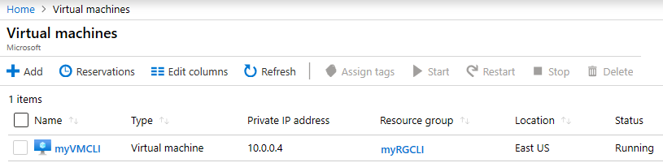

---
wts:
    title: '11 - Azure CLI로 VM 만들기'
    module: '모듈 02 - Azure 핵심 서비스'
---

# 11 - Azure CLI로 VM 만들기

이 연습에서는 Azure CLI를 로컬 컴퓨터에 설치하고 리소스 그룹과 가상 머신을 만들고 Cloud Shell에서 Azure CLI를 사용해봅니다. 그리고 Azure Advisor 권장 사항을 확인합니다.

실습 시간: 35 분

**메모**: 다음 실습은 Windows 설치를 기반으로 하지만 Mac 또는 Linux 환경에서도 동일하게 적용 할 수 있습니다. <a href="https://docs.microsoft.com/cli/azure/install-azure-cli" target="_blank"><span style="color: #0066cc;" color="#0066cc">각 환경에 대한 특정 설치 단계</span></a>를 참고하세요.

# 실습 1: 로컬 컴퓨터에 Azure CLI 설치

이 실습에서는 로컬 컴퓨터에 Azure CLI를 설치합니다.

1. <a href="https://aka.ms/installazurecliwindows" target="_blank"><span style="color: #0066cc;" color="#0066cc">Azure CLI msi</span></a>를 다운로드하고 실행합니다.

2. Microsoft Azure CLI Setup 마법사에서 **I accept the terms in the license agreement** 체크박스에 체크를 하고 **Install**을 클릭합니다.

3. **사용자 컨트롤** 창이 뜨면 **예** 버튼을 클릭하여 Microsoft Azure CLI를 설치합니다.

4. 설치가 완료되면 **Finish** 버튼을 클릭합니다.

    **메모**: Azure CLI는 Linux 또는 MacOS에서 Bash Shell을 열어 실행되거나 Windows의 명령 프롬프트 또는 PowerShell 앱에서 실행할 수 있습니다.

# 실습 2: 리소스 그룹과 가상 머신 생성

1. 로컬 컴퓨터에서 **명령 프롬프트**를 실행합니다.

    **메모**: Windows 명령 프롬프트가 아닌 PowerShell 세션에서도 Azure CLI를 실행할 수 있습니다. PowerShell에서 CLI를 실행하면 더 많은 탭 완성 기능과 같은 몇 가지 장점이 있습니다.

    **메모**: Linux 또는 MacOS에서는 Bash Shell을 실행합니다.

2. 원하는 경우 <a href="https://docs.microsoft.com/en-us/cli/azure/?view=azure-cli-latest" target="_blank"><span style="color: #0066cc;" color="#0066cc">Azure CLI 설명서</span></a>를 즐겨찾기에 등록합니다.

3. 다음 명령어를 실행하여 Azure CLI가 실행되는지와 버전을 확인합니다. Azure CLI가 정상적으로 설치되지 않으면 경고 메세지가 출력됩니다.

    ```cli
    az --version
    ```

4. Azure CLI에서 Azure에 로그인합니다. 사용자 계정 로그인 창이 뜨면 Azure 로그인 자격 증명을 입력합니다. 로그인 완료 후 출력되는 구독 및 계정 정보를 확인합니다.

    ```azurecli
    az login
    ```

    **메모**: Azure 구독이 두개 이상인 경우 출력된 구독 및 계정 정보가 실습에 사용할 구독이 **아닐 수** 있습니다. 이련 경우 다음 명령어를 사용하여 명시적으로 구독을 선택해야 합니다.
    
    ```cli
    az account set --subscription <구독 ID>
    ```

5. 새로운 리소스 그룹을 생성합니다.

    ```cli
    az group create --name myRGCLI --location SoutheastAsia
    ```

6. 리소스 그룹이 생성됐는지 확인합니다.

    ```cli
    az group list --output table
    ```

7. 다음 명령어를 사용하여 가상 머신을 생성합니다. 이 명령어는 한줄로 입력되어야 합니다. 캐럿(^)은 한 줄로 이루어진 명령어를 보기 쉽게 줄바꿈을 할 때 사용합니다.

    ```cli
    az vm create ^
        --name myVMCLI ^
        --resource-group myRGCLI ^
        --image UbuntuLTS ^
        --location SoutheastAsia ^
        --admin-username azureuser ^
        --admin-password Pa$$w0rd1234
    ```

    **메모**: PowerShell 또는 Bash Shell에서는 한 줄로 이루어진 명령어를 보기 쉽게 줄바꿈을 할 경우 캐럿(^) 대신 그레이브(`)를 사용합니다.

    **메모**: 명령을 완료하는 데 2-3 분이 걸립니다. 이 명령은 가상 머신, 스토리지, 네트워킹과 같은 가상 머신과 이와 연관된 다양한 리소스를 생성합니다. 가상 머신 배포가 완료 될 때까지 다음 단계로 넘어가지 마세요.

8. <a href="https://portal.azure.com" target="_blank"><span style="color: #0066cc;" color="#0066cc">Azure Portal</span></a>에 로그인 합니다.

9. 검색창에 **가상 머신**을 검색한 후 **myVMCLI**가 실행 중인지 확인합니다.

    

10. 로컬 컴퓨터에서 Azure CLI 세션을 닫습니다.

# 실습 3: Cloud Shell에서 명령 실행

이 실습에서는 Cloud Shell에서 Azure CLI 명령어를 실행합니다.

1. Azure Portal에서 오른쪽 상단에 있는 **>_** 아이콘을 클릭하여 **Azure Cloud Shell**을 실행합니다.

    

2. Cloud Shell을 이전에 사용했을 경우 4단계로 건너 뜁니다.

3. 메시지가 표시되면 구독에서 **실습에 이용할 구독**을 선택한 후 **스토리지 만들기**버튼을 클릭하여 Cloud Shell을 초기화 합니다.

4. 왼쪽 상단 드롭 다운 메뉴에서 **Bash**가 선택되어 있는지 확인합니다. Bash 선택되어있지 않다면 드롭 다운 메뉴를 클릭하여 **Bash**로 수정하고 **Cloud Shell의 Bash로 전환**창이 뜨면 **확인** 버튼을 눌러 Bash로 변경합니다.

    **메모**: Azure 구독이 두개 이상인 경우 다음 명령어를 사용하여 명시적으로 구독을 선택해야 합니다.
    
    ```cli
    az account set --subscription <구독 ID>
    ```

**Cloud Shell을 사용할 때는 로그인을 할 필요가 없습니다.**

6. 다음 명령어를 사용하여 가상 머신의 name, resource group, location, status를 확인합니다. PowerState는 **running**입니다.

    ```cli
    az vm show --resource-group myRGCLI --name myVMCLI --show-details --output table
    ```

7. 가상 머신을 중지합니다. 가상 머신의 할당이 해제가 될 때까지 청구가 계속된다는 메시지를 확인합니다.

    ```cli
    az vm stop --resource-group myRGCLI --name myVMCLI
    ```

8. 다음 명령어를 이용하여 가상 머신의 상태를 확인합니다. PowerState가 **stopped**로 되어있는지 확인합니다.

    ```cli
    az vm show --resource-group myRGCLI --name myVMCLI --show-details --output table 
    ```

# 실습 4: Azure Advisor 권장 사항 검토

**메모**: Azure PowerShell를 사용하여 VM 만들기에 동일한 작업이 있습니다.

이 실습에서는 가상 머신에 대한 Azure Advisor 권장 사항을 검토합니다.

1. Azure Portal에서 **Advisor**를 검색합니다.

2. Advisor에서 **개요**를 선택합니다. 권장 사항은 고 가용성, 보안, 성능, 뛰어난 운영, 비용으로 그룹화됩니다.

    

3. **모든 권장 사항**을 클릭하고 제안된 권장사항과 정보를 확인합니다.

    **메모**: 리소스에 따라 권장 사항이 달라집니다. 

    

4. 권장 사항을 CSV 또는 PDF 파일로 다운로드 할 수 있습니다.

5. 권장 사항을 알람으로 만들 수 있습니다.

6. 시간이 있으면 Azure CLI을 좀 더 실습합니다.

로컬 컴퓨터에 Azure CLI를 설치하고 Azure CLI을 사용하여 가상 머신를 만들었습니다. Azure CLI 명령어를 사용하여 가상 머신의 상태를 확인하는 연습을 한 다음 Advisor 권장 사항을 확인했습니다.

**메모**: 추가 비용을 피하기 위해 리소스 그룹을 제거할 수 있습니다. 리소스 그룹(myRGPS)을 검색하고 리소스 그룹 블레이드에서 **Delete resource group**을 클릭한 후 삭제 창에 리소스 그룹 이름 입력란에 리소스 그룹 이름(myRGPS)을 입력합니다. 리소스 그룹 이름을 정확히 입력하면 하단에 **삭제** 버튼이 활성화 되며 삭제 버튼을 클릭하여 생성한 리소스들을 삭제합니다. **알람**에서 모니터링 할 수 있습니다.
