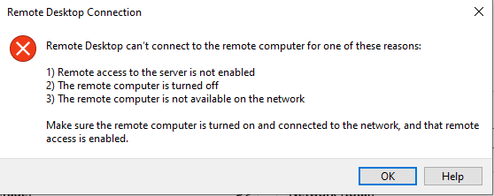

---
wts:
    title: '12 - 안전한 네트워크 통신'
    module: '모듈 03 - 보안, 개인정보보호, 규정준수, 신뢰'
---

# 12 - 안전한 네트워크 통신

이 연습에서는 인바운드 및 아웃바운드 보안 규칙을 만들고 구성합니다.

실습 시간: 45 분

# Task 1: 가상 머신 만들기

이 실습에서는 가상 머신을 생성하는 사용자 정의 템플릿을 배포합니다. 

1. <a href="https://portal.azure.com" target="_blank">Azure Portal</a>에 로그인 합니다.

2. 검색창에 **Template ddeployment (deploy using custom templates)**를 검색합니다. Marketplace 영역에 있습니다.

3. **Windows 가상 머신 만들기**를 클릭합니다.

4. 다음을 이용하여 정보를 입력합니다.

    | 설정 | 값 |
    | -- | -- |
    | 구독 | **실습에 이용할 구독**|
	| 리소스 그룹 | **myRGSecure** (새로 만들기) |
    | 위치 | **(아시아 태평양)아시아 남동부** |
    | Admin Username | **azureuser** |
    | Admin Password | **Pa$$w0rd1234** |
    | DNS Lable Prefix | **myrgsecurexxx** (유니크 해야 함) |
    | Windows OS Version | 2016-Datacenter |
    | | |

5. **위에 명시된 사용 약관에 동의함** 체크박스에 체크합니다.. 

6. **구매** 버튼을 클릭합니다. 

7. 배포를 모니터링합니다. 리소스 그룹과 가상 머신을 배포하는 데 몇 분이 소요될 수 있습니다.

8. **알람** 창에서 **리소스로 이동** 버튼을 클릭합니다. 

9. **SimpleWinVM** 가상 머신을 선택합니다.

10. 왼쪽 네비게이터에서 **네트워킹**을 선택하면 네트워크 인터페이스에 네트워크 보안 그룹이 연결되어 있지 않은 것을 확인할 수 있습니다.

    **메모**: 연결되어있는 네트워크 보안 그룹은 네트워크 인터페이스가 아닌 서브넷에 연결되어 있습니다.

    

11. 또한 연결된 네트워크 인터페이스의 이름이 **myVMNic**인지 확인합니다.

12. 실습을 위해 서브넷에 연결된 네트워크 보안 그룹의 연결을 해제합니다. *(서브넷에 연결됨: Subnet)*에 있는 **Subnet**을 클릭합니다.

13. Subnet 블레이드에서 **네트워크 보안 그룹** 드롭 다운 메뉴에서 **없음**을 선택한 후 상단에 **저장**을 클릭하여 Subnet에 연결되어있는 네트워크 보안 그룹의 연결을 해제합니다.

# 실습 2: 네트워크 보안 그룹 만들기

이 실습에서는 네트워크 보안 그룹을 만들고 네트워크 인터페이스와 연결합니다.

1. Azure Portal의 검색창에 **네트워크 보안 그룹**을 검색합니다. 

2. **+추가** 버튼을 클릭하고 다음을 이용하여 정보를 입력합니다.

    | 설정 | 값 |
    | -- | -- |
    | 구독 | **실습에 이용할 구독**|
    | 리소스 그룹 | **myRGSecure** (기존에 생성한 리소스 그룹) |
    | 이름 | **myNSGSecure** |
    | 지역 | **(아시아 태평양)아시아 남동부**  |
    | | |

3. **검토 + 만들기** 버튼을 클릭하여 유효성 검사를 한 후 **만들기** 버튼을 클릭합니다.

4. 네트워크 보안 그룹의 배포가 완료되면 **리소스로 이동** 버튼을 클릭합니다.

5. **설정** 섹션에서 **네트워크 인터페이스**를 클릭하고 **+연결**을 클릭합니다.

6. 생성한 가상 머신에 연결된 **myVMNic**를 클릭하여 네트워크 인터페이스에 네트워크 보안 그룹을 연결합니다.

# 실습 3: RDP를 허용하도록 인바운드 포트 규칙 구성

이 실습에서는 인바운드 보안 규칙을 구성하여 가상 머신에 RDP 연결을 허용합니다.

1. 새로운 가상 머신을 탐색합니다.

2. **개요** 블레이드에서 **연결**을 클릭하여 RDP를 다운로드 합니다.

    **메모**: Windows 컴퓨터에서 VM에 연결하는 방법에 대한 지침입니다. Mac에서는 Mac App Store에서 원격 데스크톱 클라이언트와 같은 RDP 클라이언트가 필요합니다.

3. RDP를 사용하여 가상 시스템에 연결을 시도합니다. 기본적으로 네트워크 보안 그룹은 RDP를 허용하지 않습니다. 오류 창을 닫습니다. 

    

4. **설정** 영역에 있는 **네트워킹**을 클릭하고 **인바운드 포트 규칙**을 확인합니다. 기본 규칙은 로드 밸런서를 포함하여 가상 네트워크 내 트래픽을 제외한 모든 인바운드 트래픽을 거부합니다.

5. **인바운드 포트 규칙 추가** 버튼을 클릭하고 다음을 이용하여 정보를 입력한 후 **추가** 버튼을 클릭합니다.

    

    | 설정 | 값 |
    | -- | -- |
    | 소스 | **Any**|
    | 원본 포트 범위 | * |
    | 대상 주소 | **Any** |
    | 대상 포트 범위 | **3389** |
    | 프로토콜 | **TCP** |
    | 작업 | **허용** |
    | 우선 순위 | **300** |
    | 이름 | **Allow_RDP** |
    | | |

6. 설정한 규칙이 배포 될 때까지 기다린 후 가상 머신에 RDP 연결을 다시 시도합니다. 이번에는 성공해야 합니다. 사용자 계정은 **azureuser**이고 암호는 **Pa$$w0rd1234**입니다.

# 실습 4: 인터넷 액세스를 거부하도록 아웃바운드 포트 규칙 구성

이 실습에서는 생성된 네트워크 보안 그룹의 아웃바운드 포트 구성에서 인터넷 액세스를 거부하고 규칙이 작동하는지 테스트합니다.

1. RDP를 이용하여 가상 머신 세션에 연결합니다.

2. 가상 머신에 접속하면 **Internet Explorer**를 실행합니다.

3. www.bing.com 에 접속할 수 있는지 확인합니다. IE 보안 강화 팝업을 통해 작업해야합니다.

**메모**: 이제 아웃바운드 포트 규칙에서 인터넷 액세스를 거부하는 규칙을 구성합니다.

4. Azure Portal로 돌아와서 가상 머신을 탐색합니다.

5. **설정** 영역에 있는 **네트워킹**을 클릭하고 **아웃바운드 포트 규칙** 탭을 클릭합니다.

6. **AllowInternetOutbound** 있습니다만, 이 기본 정책은 삭제할 수 없습니다.

7. **아웃바운드 포트 규칙 추가** 버튼을 클릭하고 다음을 이용하여 인터넷 트래픽을 거부하는 규칙을 구성합니다. 구성이 완료되면 **추가** 버튼을 클릭하여 아운바운드 포트 규칙을 배포합니다.

    | 설정 | 값 |
    | -- | -- |
    | 소스 | **Any**|
    | 원본 포트 범위 | * |
    | 대상 주소 | **Service tag** |
    | 대상 서비스 태그 | **Internet** |
    | 대상 포트 범위 | * |
    | 프로토콜 | **TCP** |
    | 작업 | **거부** |
    | 우선 순위 | **4000** |
    | 이름 | **Deny_Internet** |
    | | |

8. 보안 규칙의 배포가 완료되면 RDP 세션으로 돌아갑니다.

9. www.microsoft.com 에 접속을 시도합니다. 이번에는 접속이 되지 않는 것을 확인할 수 있습니다.

**메모**: 추가 비용을 피하기 위해 리소스 그룹을 제거할 수 있습니다. 리소스 그룹(myRGSecure)을 검색하고 리소스 그룹 블레이드에서 **Delete resource group**을 클릭한 후 삭제 창에 리소스 그룹 이름 입력란에 리소스 그룹 이름(myRGSecure)을 입력합니다. 리소스 그룹 이름을 정확히 입력하면 하단에 **삭제** 버튼이 활성화 되며 삭제 버튼을 클릭하여 생성한 리소스들을 삭제합니다. **알람**에서 모니터링 할 수 있습니다.
