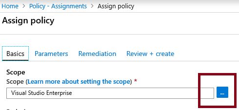
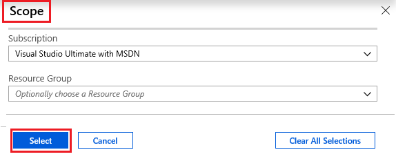
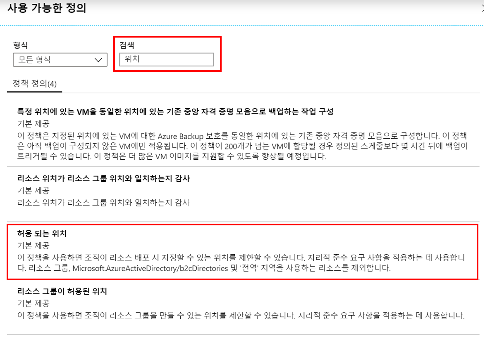
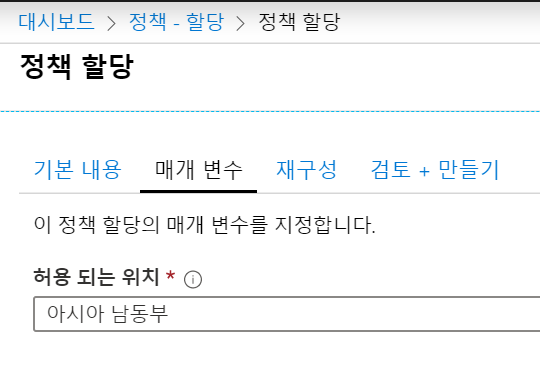
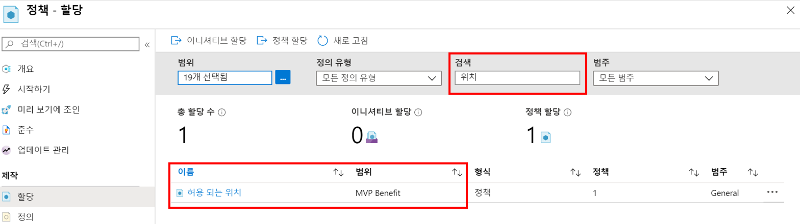
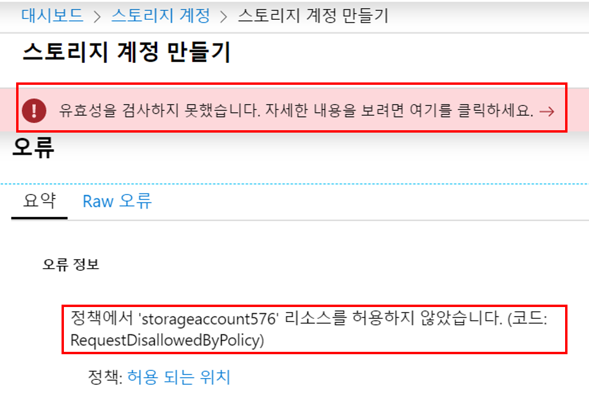
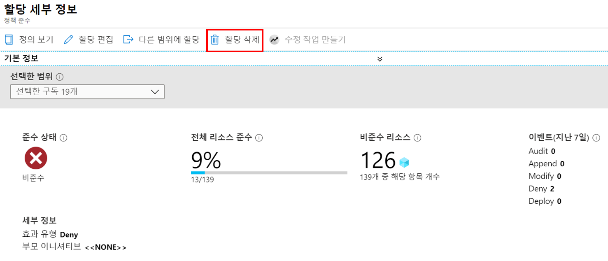

---
wts:
    title: '14 - Azure 정책 만들기'
    module: '모듈 03 - 보안, 개인정보보호, 규정준수, 신뢰'
---

# 14 - Azure 정책 만들기

이 연습에서는 Azure 리소스 배포를 특정 위치로 제한하는 Azure 정책을 만듭니다.

실습 시간: 20 분

# 실습 1: 정책 할당 만들기

이 실습에서는 허용 된 지역(Region) 정책을 구성하고 구독에 할당합니다.

1. <a href="https://portal.azure.com" target="_blank">Azure Portal</a>에 로그인 합니다.

2. 검색창에 **정책**을 검색합니다. **제작** 섹션에서 **정의**를 클릭합니다. 기본 제공 정책 정의 목록을 검토합니다. 예를 들어 **범주**의 드롭 다운 메뉴를 클릭하여 **Compue**만 선택합니다. **허용된 가상 머신 크기** 정의를 사용하면 조직이 배포할 수 있는 가상 머신의 크기를 지정할 수 있습니다.

3. **정책** 블레이드로 돌아가 **제작** 섹션에서 **할당**을 클릭합니다. 할당은 정의된 정책이 특정 범위 내에 적용하도록 할당합니다. 예를 들어 정의를 구독에 할당 할 수 있습니다.

4. **정책 - 할당** 블레이드에서 **정책 할당**을 클릭합니다.

5. **정책 할당** 블레이드에서 범위에 있는 줄임표 버튼을 클릭하여 범위 선택 창을 띄웁니다.

    

6. 실습에서 이용할 구독을 선택합니다. 리소스 그룹을 선택하여 정책 적용 범위를 지정할 수 있습니다. 기본값을 그대로두고 **선택**을 클릭합니다.

    **메모**: 범위는 정책 할당이 적용되는 리소스 또는 리소스 그룹을 결정합니다. 이 경우이 정책을 특정 리소스 그룹에 할당 할 수 있지만 구독 수준에서 정책을 할당합니다. 또한 범위에 따라 리소스를 제외 할 수 있습니다. 제외는 선택 사항입니다.

    

7. **기본 내용**섹션의 **정책 정의**에 있는 줄임표 버튼을 클릭합니다. **검색**에 **위치**를 입력하고 **허용 되는 위치** 정의를 클릭 한 다음 **선택** 버튼을 클릭합니다.

    **메모**: 이 **허용 되는 위치** 정책 정의는 모든 자원을 배치해야 하는 위치를 지정합니다. 다른 위치를 선택하면 배포가 허용되지 않습니다. 자세한 내용은 [Azure Policy 샘플](https://docs.microsoft.com/ko-kr/azure/governance/policy/samples/index) 페이지를 참조하세요.

   

8. **정책 할당** 블레이드의 **매개 변수** 탭에서 **허용 되는 위치** 드롭 다운 메뉴를 클릭하고 **아시아 남동부**를 선택합니다. 다른 모든 값은 그대로 두고 **검토 + 만들기** 버튼을 클릭 한 다음 **만들기** 버튼을 클릭합니다.

    

9. **정책 - 할당** 블레이드에서 **허용 되는 위치** 정책 할당이 표시되는지 확인할 수 있으며 지정한 범위(구독) 수준에서 적용됩니다.

   

# 실습 2: 허용 되는 위치 정책 테스트

이 작업에서는 허용 되는 위치 정책을 테스트합니다.

1. Azure Portal에서 검색창에 **스토리지 계정**을 검색하고 **+추가**를 클릭합니다.

2. 다음을 이용하여 스토리지 계정 정보를 입력합니다. 

    | 설정 | 값 | 
    | --- | --- |
    | 구독 | **실습에 이용할 구독**|
	| 리소스 그룹 | **myRGPolicy** (새로 만들기) |
    | 스토리지 계정 이름 | **storageaccountxxx** (유니크 해야 함) |
    | 위치 | **(미국)미국 동부** |
    | | |

3. **검토 + 만들기** 버튼을 클릭합니다.

4. **유효성을 검사하지 못했습니다.** 메시지가 표시되고 **자세한 내용을 보려면 여기를 클릭하세요.** 메시지를 클릭하여 오류 메시지를 자세히 봅니다. **오류** 블레이드의 **요약** 탭에서 **정책에서 'storageaccountxxx' 리소스를 허용하지 않았습니다.**라는 오류 메시지와 정책 이름이 **허용 되는 위치**로 표시된 것을 확인합니다.

    **메모**: **Raw 오류** 탭을 클릭하여 출력된 내용을 보면 허용 되는 위치 정책이 배포를 차단 한 정책임을 자세히 알아볼 수 있습니다.

    

# 실습 3: 정책 할당 삭제와 테스트

이 실습에서는 허용 되는 위치의 정책 할당을 제거하고 테스트합니다. 향후 수행 할 작업이 차단되지 않도록 **정책 할당을 삭제해야**합니다.

1. Azure Portal에서 검색창에 **정책**을 검색하고 **개요** 블레이드에서 표시되는 **허용 되는 위치**를 선택합니다.

2. 할당한 정책의 준수 상태를 확인할 수 있습니다.

    **메모**: 허용 되는 위치 정책에 준수되지 않은 리소스가 표시 될 수 있습니다. 그것은 정책을 할당하기 전에 생성 된 리소스입니다.

3. 상단 메뉴에 있는 **할당 삭제**를 클릭합니다.

   

4. **할당 삭제** 창이 뜨면 **예** 버튼을 클릭하여 정책 할당을 삭제합니다.

5. 정책이 더 이상 적용되지 않는지 실습 2에서 작업했던 스토리지 계정을 생성해 봅니다.

    **메모**: **허용 되는 위치** 정책이 유용한 몇 가지 시나리오는 다음과 같습니다. 
    - *비용 추적*: 지역별로 다른 구독을 관리할 수 있으며 해당 지역에 모든 리소스가 배포되어 비용 추적에 도움이 됩니다.
    - *데이터 상주 및 보안 규정 준수*: 또한 데이터 상주 요구 사항이 있는 고객 또는 특정 워크로드에 구독을 생성하고 데이터 및 보안 규정 준수 요구 사항을 보장하기 위해 모든 데이터를 특정 데이터 센터에 배포하도록 정의 할 수 있습니다.

Azure 리소스의 배포를 특정 데이터 센터로 제한하기 위해 Azure 정책을 만들었습니다.

**메모**: 추가 비용을 피하기 위해 리소스 그룹을 제거할 수 있습니다. 리소스 그룹(myRGPolicy)을 검색하고 리소스 그룹 블레이드에서 **Delete resource group**을 클릭한 후 삭제 창에 리소스 그룹 이름 입력란에 리소스 그룹 이름(myRGPolicy)을 입력합니다. 리소스 그룹 이름을 정확히 입력하면 하단에 **삭제** 버튼이 활성화 되며 삭제 버튼을 클릭하여 생성한 리소스들을 삭제합니다. **알람**에서 모니터링 할 수 있습니다.
