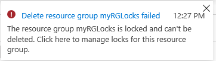

---
wts:
    title: '16 - 리소스 잠금 관리'
    module: '모듈 03 - 보안, 개인정보보호, 규정준수, 신뢰'
---

# 16 - 리소스 잠금 관리

이 연습에서는 리소스 그룹을 만들고 리소스 그룹에 잠금을 추가하고 삭제를 테스트하며 리소스 그룹에서 리소스 삭제를 테스트하고 리소스 잠금을 제거합니다.

실습 시간: 15 분

# 실습 1: 리소스 그룹 만들기

이 실습에서는 리소스 그룹을 만듭니다.

1. <a href="https://portal.azure.com" target="_blank">Azure Portal</a>에 로그인 합니다.

2. 검색창에 **리소스 그룹**을 검색하고 **+추가**를 클릭합니다.

3. 다음을 이용하여 새로운 리소스 그룹을 생성합니다.

    | 설정 | 값 |
    | -- | -- |
    | 구독 | **실습에 이용할 구독**|
	| 리소스 그룹 | **myRGLocks** |
    | 영역 | **(아시아 태평양)아시아 남동부** |
    | | |

# 실습 2: 리소스 그룹에 잠금 추가 및 삭제 테스트

이 실습에서는 리소스 그룹에 리소스 잠금을 추가하고 리소스 그룹의 삭제를 테스트합니다. 

1. 새로 만든 **myRGLocks** 리소스 그룹을 탐색합니다.

2. 구독, 리소스 그룹 또는 개별 리소스에 **잠금**을 적용하여 다른 사용자가 실수로 중요한 리소스를 삭제하거나 수정하지 못하게 할 수 있습니다.

3. **설정**섹션에서 **잠금**을 클릭하고 **+추가**를 클릭합니다. 

    

4. 잠금 추가창이 뜨면 다음을 이용하여 정보를 입력하고 **확인** 버튼을 클릭합니다.

    | 설정 | 값 |
    | -- | -- |
    | 잠금 이름 | **RGLock** |
    | 잠금 유형 | **삭제** |
    | | |

5. 리소스 그룹의 **개요** 블레이드를 선택하고 **Delete resource group**를 클릭합니다. 리소스 그룹의 이름을 확인하고 **삭제** 버튼을 클릭합니다. 리소스 그룹이 잠겨 있어 삭제할 수 없다는 오류 메시지가 표시됩니다.

    

# 실습 3: 리소스 그룹의 리소스 삭제 테스트

이 실습에서는 리소스 그룹에 설정된 리소스 잠금이 리소스 그룹에 생성된 스토리지 계정을 보호하는지 테스트합니다.

1. Azure Portal에서 검색창에 **스토리지 계정**을 검색한 후 **+추가**를 클릭합니다.

2. 다음을 이용하여 정보를 입력하고 **리뷰 + 만들기** 버튼을 클릭한 다음 **만들기** 버튼을 클릭합니다.

    | 설정 | 값 | 
    | --- | --- |
    | 구독 | **실습에 이용할 구독**|
	| 리소스 그룹 | **myRGLocks** |
    | 스토리지 계정 이름 | **storageaccountxxx** (유니크 해야 함) |
    | 위치 | **(아시아 태평양)아시아 남동부**  |
    | 성능 | **표준** |
    | 계정 종류 | **StorageV2(범용 v2)** |
    | 복제 | **LRS(로컬 중복 스토리지)** |
    | 액세스 계층(기본값) | **핫** |
    | | |

3. 스토리지 계정의 배포가 완료될 때 까지 기다립니다. **알람**에서 모니터링 할 수 있습니다.

4. 생성한 스토리지 계정을 탐색하여 **개요** 블레이드에서 **삭제**를 클릭합니다. 리소스 또는 해당 부모에 삭제 잠금이 있음을 나타내는 오류 메시지가 표시됩니다.

    

    **메모**: 스토리지 계정에서 잠금을 만들지는 않았지만 스토리지 계정이 생성 된 리소스 그룹에서 잠금을 만들었습니다. 따라서 이 *부모* 수준의 잠금은 리소스를 삭제하지 못하므로 스토리지 계정은 부모로 부터 잠금을 상속합니다.

# 실습 4: 리소스 잠금 삭제

이 실습에서는 리소스 잠금을 삭제하고 테스트 합니다.

1. 리소스 그룹으로 돌아가서 **설정** 섹션에 있는 **잠금**을 클릭합니다.
    
2. 잠금에 있는 **삭제**를 클릭합니다.

    

3. **개요** 블레이드에서 상단 메뉴에 **Delete resource group**을 클릭하고 리소스 그룹 이름을 확인한 후 **삭제** 버튼을 클릭하여 리소스 그룹이 삭제되는지 확인합니다.

리소스 그룹을 만들고 리소스 그룹에 잠금을 추가 한 후 삭제를 테스트하고 리소스 그룹에 포함된 리소스의 삭제를 테스트 한 후 리소스 잠금을 삭제했습니다.
