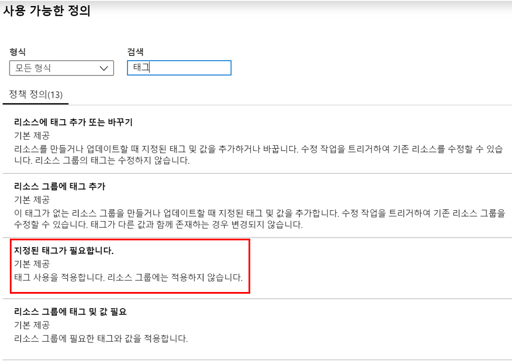
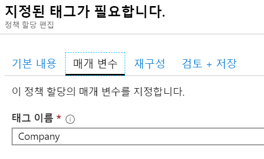
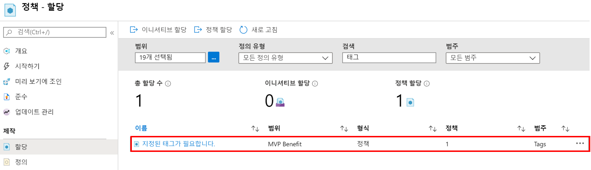
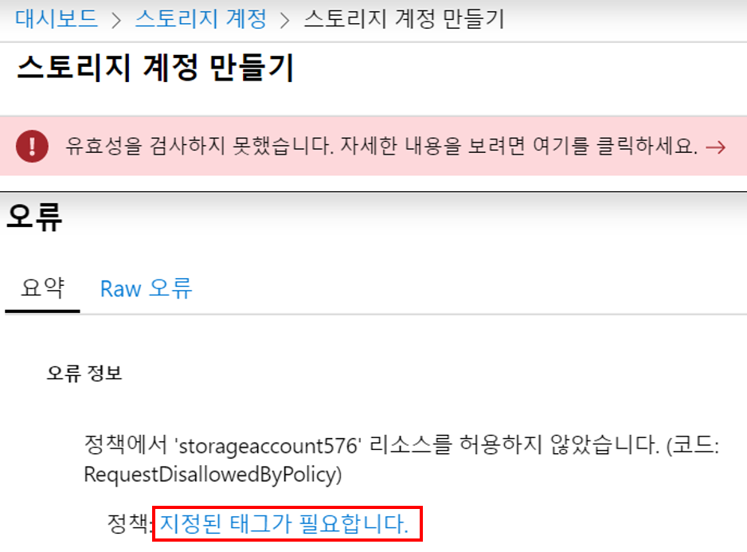
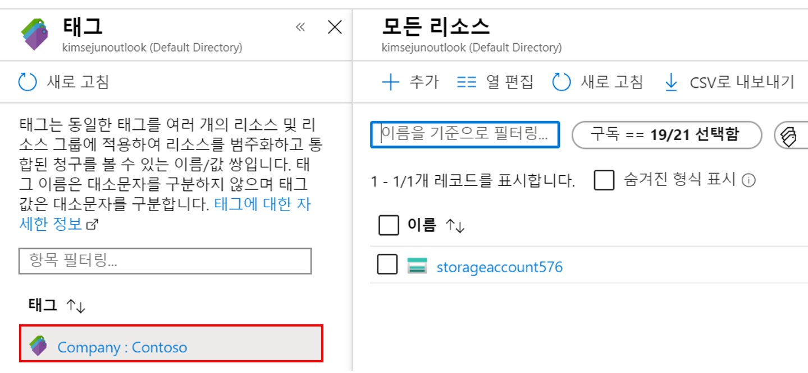

---
wts:
    title: '17 - 리소스 태깅 구현'
    module: '모듈 03 - 보안, 개인정보보호, 규정준수, 신뢰'
---

# 17 - 리소스 태깅 구현

이 연습에서는 태깅이 필요한 정책 할당을 생성하고, 스토리지 계정을 생성하여 태깅을 테스트하고 지정된 태그가 있는 리소스를 보고 태깅 정책을 제거합니다.

실습 시간: 30 분

# 실습 1: 정책 할당 만들기

이 실습에서는 **지정된 태그 필요** 정책을 구성하고 구독에 할당합니다.

1. <a href="https://portal.azure.com" target="_blank">Azure Portal</a>에 로그인 합니다.

2. 검색창에 **정책**을 검색합니다.

3. **제작** 섹션에서 **할당**을 클릭하고 **정책 할당**을 클릭합니다.

4. 정책의 **범위**는 실습에서 이용 할 구독을 선택합니다.

5. **정책 정의**에 있는 줄임말 버튼을 클릭하여 **사용 가능한 정의** 창의 뜨면 검색에 **태그**를 입력하고 출력된 목록에서 **지정된 태그가 필요합니다.**를 선택한 후 **선택**버튼을 클릭합니다.

   

6. **정책 할당** 블레이드의 **매개 변수** 탭으로 이동하여 태그 이름에 **Company**를 입력합니다. **검토 + 만들기** 버튼을 클릭 한 다음 **만들기** 버튼을 클릭합니다.

    **메모**: 태그를 보여주는 간단한 예시 입니다.

    

7. **지정된 태그가 필요합니다.** 정책 할당이 완료되었습니다. 구독에 리소스를 생성할 시 Company 태그를 제공해야합니다.

   

# 실습 2: 스토리지 계정을 생성하여 지정된 태그가 필요한지 테스트

이 실습에서는 지정된 태그가 필요합니다. 정책이 정상적으로 적용되었는지 확인하기 위해 스토리지 계정을 만들어 봅니다.

1. Azure Portal에서 검색창에 **스토리지 계정**을 검색하고 **+추가**를 클릭합니다.

2. 다음을 이용하여 스토리지 계정 정보를 입력합니다. 

    | 설정 | 값 | 
    | --- | --- |
    | 구독 | **실습에 이용할 구독**|
	| 리소스 그룹 | **myRGTags** (새로 만들기) |
    | 스토리지 계정 이름 | **storageaccountxxx** (유니크 해야 함) |
    | 위치 | **(아시아 태평양)아시아 남동부** |
    | | |

3. **리뷰 + 만들기** 버튼을 클릭합니다. 

**메모**: 태그가 제공되지 않은 경우 어떤 일이 발생하는지 테스트 중입니다.

4. **유효성을 검사하지 못했습니다.** 메시지가 표시되고 **자세한 내용을 보려면 여기를 클릭하세요.** 메시지를 클릭하여 오류 메시지를 자세히 봅니다. **오류** 블레이드의 **요약** 탭에서 **정책에서 'storageaccountxxx' 리소스를 허용하지 않았습니다.**라는 오류 메시지와 정책 이름이 **지정된 태그가 필요합니다.**로 표시된 것을 확인합니다.

    **메모**: Raw 오류 탭을 보면 필요한 특정 태그 이름이 표시됩니다.

    

5. **오류** 창을 닫고 **태그** 탭으로 이동하고 다음을 이용하여 태깅 정보를 제공합니다.

    | 설정 | 값 | 
    | --- | --- |
    | 태그 이름 | **Company** (드롭 다운 목록에 없을 수 있습니다) |
    | 태그 값 | **Contoso** |
    | | |

6. **검토 + 만들기** 버튼을 클릭합니다. 이번엔 유효성 검사가 통과합니다. **만들기** 버튼을 클릭하여 스토리지 계정을 배포합니다.

# 실습 3: 특정 태그가 있는 모든 리소스보기

이 실습에서는 특정한 태그가 있는 모든 리소스를 확인합니다.

1. Azure Portal에서 검색창에 **태그**를 검색합니다.

2. 사용 가능한 모든 태그/값이 표시됩니다. **Company : Contoso** 쌍을 선택하면 생성한 스토리지 계정을 확인할 수 있습니다. 스토리지 계정의 배포가 완료되어야 합니다.

   

3. Azure Portal에서 **모든 리소스**를 선택합니다.

4. **필터 추가**를 클릭하고 **Company** 태그를 추가합니다. 사용 가능한 태그 값으로 검색을 제한 할 수 있습니다. 필터가 적용되면 스토리지 계정을 확인할 수 있습니다.

    

# 실습 4: 정책 할당 삭제

이 작업에서는 **지정된 태그가 필요합니다.** 정책을 제거하여 향후 작업에 영향을 미치지 않도록 합니다.

1. Azure Portal에서 검색창에 **정책**을 검색하고 **지정된 태그가 필요합니다.** 정책을 클릭합니다.

2. 상단 메뉴에 있는 **할당 삭제**를 클릭합니다.

3. **할당 삭제** 창이 뜨면 **예** 버튼을 클릭하여 정책 할당을 삭제합니다.

4. 시간이 있으면 다른 리소스를 만들어 정책이 더 이상 적용되지 않는지 확인합니다.

태그 지정이 필요한 정책 할당을 생성하고 스토리지 계정을 생성 한 후 태그 지정을 테스트하고 지정된 태그를 사용하여 리소스를 보고 태그 지정 정책을 제거했습니다.

**메모**: 추가 비용을 피하기 위해 리소스 그룹을 제거할 수 있습니다. 리소스 그룹(myRGTags)을 검색하고 리소스 그룹 블레이드에서 **Delete resource group**을 클릭한 후 삭제 창에 리소스 그룹 이름 입력란에 리소스 그룹 이름(myRGTags)을 입력합니다. 리소스 그룹 이름을 정확히 입력하면 하단에 **삭제** 버튼이 활성화 되며 삭제 버튼을 클릭하여 생성한 리소스들을 삭제합니다. **알람**에서 모니터링 할 수 있습니다.
