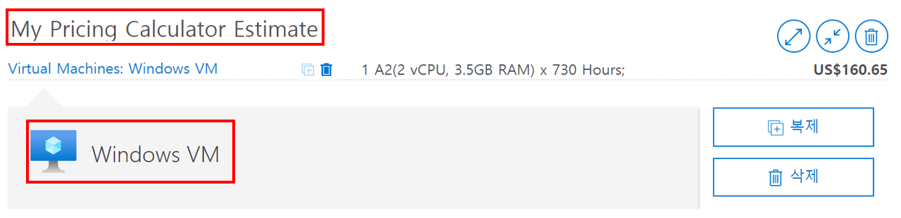
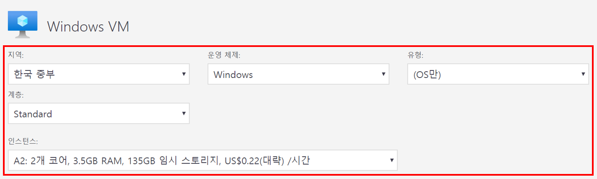
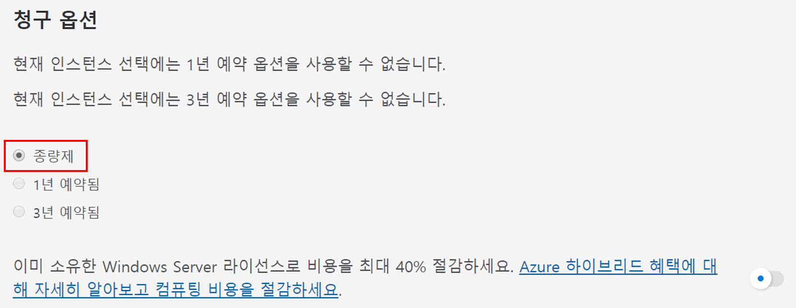
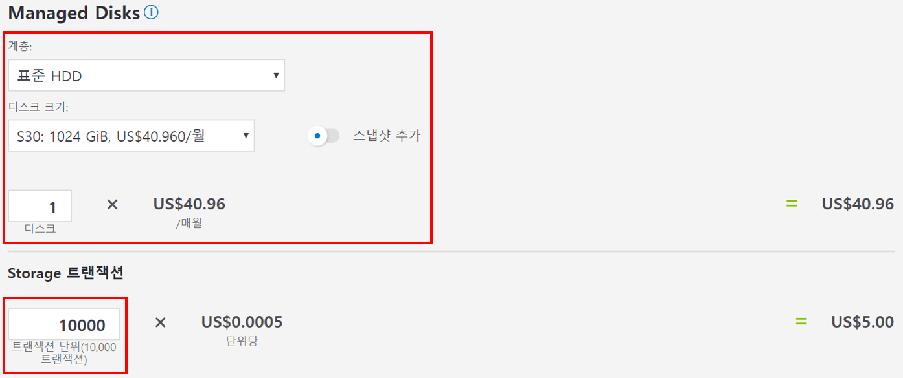
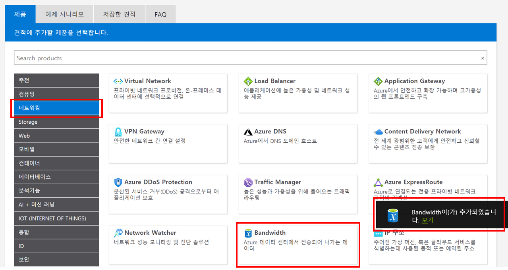
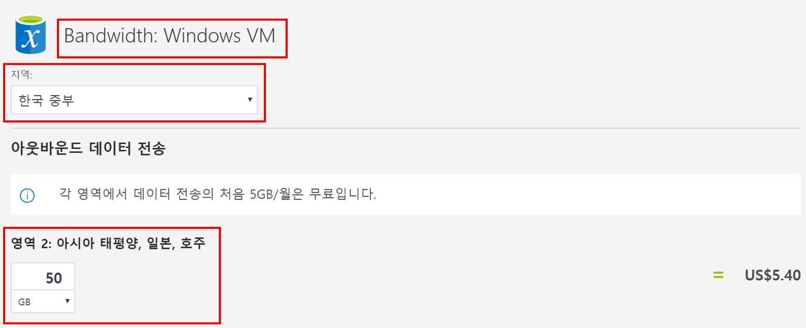
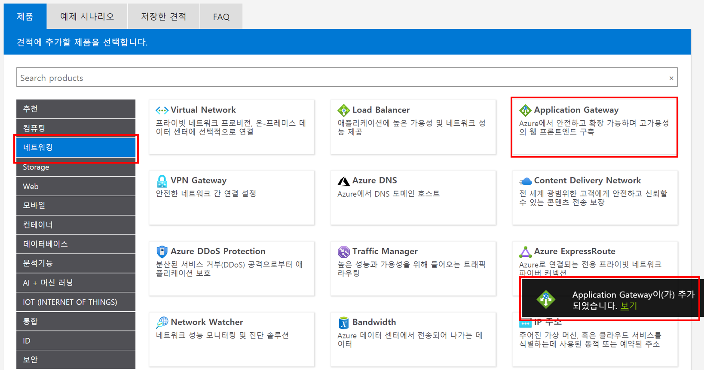
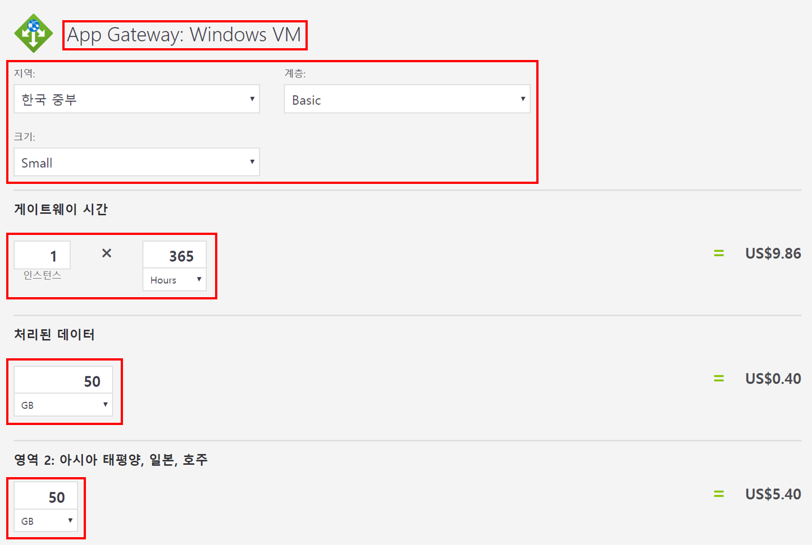
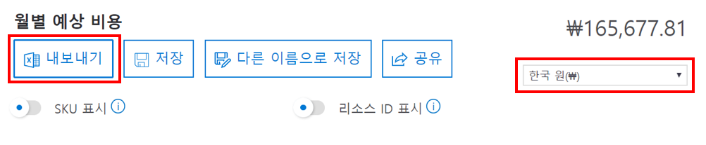
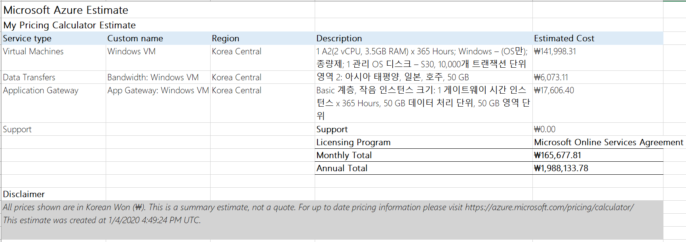

---
wts:
    title: '19 - Azure 가격 계산기 사용'
    module: '모듈 04 - Azure 과금과 지원'
---

# 19 - Azure 가격 계산기 사용

이 연습에서는 Azure 가격 계산기를 사용하여 Azure 가상 컴퓨터 및 관련 네트워크 리소스에 대한 비용 견적을 확인합니다.

실습 시간: 30 분

# 실습 1: Azure 가격 계산기 구성

이 실습에서는 Azure 가격 계산기를 사용하여 간단한 인프라 구성에 대한 비용 견적을 확인합니다.

**메모**: Azure 가격 계산기의 예상 수치를 만들기 위해 이 연습에서는 VM 및 관련 리소스에 대한 구성을 제공합니다. 예제 구성을 사용하거나 *실제* 리소스 요구 사항에 대한 세부 정보를 Azure 가격 계산기에 제공하십시오.

1. 브라우저에서 <a href="https://azure.microsoft.com/ko-kr/pricing/calculator/" target="_blank">Azure 가격 계산기</a> 웹페이지를 탐색합니다.

2. VM 구성에 대한 세부 사항을 추가하려면 **제품** 탭에서 **Virtual Machine**을 선택합니다. 가상 머신 세부 사항을 보려면 아래로 스크롤합니다. 

3. Azure 가격 계산기의 견적 이름과 구성할 VM 이름을 입력합니다. 견적 이름에 **My Pricing Calculator Estimate**를 사용하고 VM 이름에 **Windows VM**을 사용합니다.

   

4. 기본 VM 구성을 수정합니다.

    | 지역 | 운영 체제 | 유형|
    | --- | --- | --- |
    | 한국 중부 | Windows | (OS만) |
    | | |

    | 계층 | 인스턴스 |
    | --- | --- |
    | Standard | A2: 2개 코어, 3.5GB RAM, 135GB 임시 스토리지 |
    | | |

   

    **메모**: VM 인스턴스 사양 및 요금은 이 예와 다를 수 있습니다. 예제와 최대한 일치하는 인스턴스를 선택하여 이 연습을 따릅니다. 다양한 VM 제품 옵션에 대한 자세한 내용을 보려면 오른쪽의 **추가 정보** 메뉴에서 **제품 정보**를 선택합니다.

5. **청구 옵션**에서 **종량제**를 선택합니다.

   

6. Azure에서 한 달은 730시간으로 정의됩니다. VM을 매월 100% 사용할 수 있어야 하는 경우 월별 시간 값을 `730`으로 설정합니다. 이 예제에서는 VM 하나를 매월 시간의 50%를 사용합니다.

    Virtual Machine 수는 `1`로, Hours는 `365`로 설정합니다.

   

7. **Managed Disk** 섹션에서 기본 VM 스토리지 구성을 수정합니다.

    | 계층 | 디스크 크기 | 디스크 개수 | 스냅샷 | Storage 트랜잭션 |
    | --- | --- | --- | --- | --- |
    | 표준 HDD | S30: 1024 GiB | 1 | Off | 10,000 |

   

8. 견적에 네트워킹 대역폭을 추가하려면 Azure 가격 계산기 웹 페이지의 상단으로 이동합니다. 왼쪽의 제품 메뉴에서 **네트워킹**을 선택한 다음 **Bandwidth**를 선택합니다 **Bandwidth이(가) 추가되었습니다.** 메시지 대화 상자에서 **보기**를 클릭합니다.

   

9. 대역폭 구성의 이름을 **Bandwidth: Windows VM**으로 입력하고 다음 정보를 참고하여 대역폭 구성을 수정합니다.

    | 지역 | 영역 2: 아시아 태평양, 일본, 호주 |
    | --- | --- |
    | North Europe | 50 GB |

   

10. 견적에 응용 프로그램 게이트웨이를 추가하려면 Azure 가격 계산기 웹 페이지의 상단으로 돌아갑니다. **네트워킹** 제품 메뉴에서 **Application Gateway**를 선택합니다. **Application Gateway이(가) 추가 되었습니다.** 메시지 대화 상자에서 **보기**를 클릭합니다.

    

11. Application Gateway 구성의 이름을 **App Gateway: Windows VM**으로 입력하고 다음 정보를 참고하여 Application Gateway 구성을 수정합니다.

    | 지역 | 계층 | 크기 |
    | --- | --- | --- |
    | 한국 중부 | Basic | Small |
    | | |

    | 인스턴스 | 시간 |
    | --- | --- |
    | 1 | 365 |
    | | |

    | 처리된 데이터 |
    | --- |
    | 50 GB |
    | | |

    | 영역 2: 아시아 태평양, 일본, 호주 |
    | --- |
    | 50 GB |
    | | |

    

# 실습 2: 비용 견적 검토

이 실습에서는 Azure 가격 계산기의 결과를 검토합니다.

1. Azure 가격 계산기 웹페이지의 맨 아래로 스크롤하여 총 **월별 예상 비용**을 확인합니다.

    **메모**: Azure 가격 계산기에서 사용할 수 있는 다양한 옵션을 살펴봅니다. 예를 들어 이 연습에서는 통화를 **한국 원**으로 업데이트합니다.

2. 통화를 **한국 원**으로 변경 한 다음 **내보내기** 버튼을 클릭하여 Microsoft Excel (`.xlsx`) 형식으로 오프라인에서 볼 수 있는 견적 사본을 다운로드합니다.

    

    

Azure 가격 계산기에서 견적을 구성하고 다운로드했습니다.
