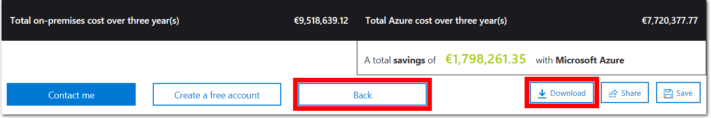

---
wts:
    title: '20 - Azure TCO 계산기 사용하기'
    module: '모듈 04 - Azure 과금과 지원'
---

# 20 - Azure TCO 계산기 사용하기

이 연습에서는 총 소유 비용(TCO) 계산기를 사용하여 온-프레미스 환경에 대한 비용 비교 보고서를 생성합니다.

실습 시간: 20 분

**메모**: 이 연습에서는 일반적인 데이터센터의 온-프레미스 인프라와 워크로드에 대한 예제를 제공합니다. TCO 계산기 보고서를 작성하려면 이 예제를 사용하거나 *실제* 온-프레미스 인프라와 워크로드에 대한 세부 내용을 제공하십시오.

# 실습 1: TCO 계산기 구성

이 실습에서는 인프라 정보를 TCO 계산기에 추가합니다.

1. 브라우저에서 <a href="https://azure.microsoft.com/ko-kr/pricing/tco/calculator/" target="_blank">총 소유 비용(TCO) 계산기</a> 웹페이지를 탐색합니다.

2. 온-프레미스 서버 인프라에 대한 세부 정보를 추가하려면 **워크로드 정의** 섹션에서 **+ 서버 워크로드 추가**를 클릭합니다.

    | 설정 | 값 |
    | -- | -- |
    | 이름 | **Servers: Windows VMs** |
    | 작업 | **Windows/Linux 서버** |
    | 환경 | **Virtual Machines** |
    | 운영 체제 | **Windows** |  
    | VM | **50** |
    | 가상화 | **Hyper-V** |
    | 코어 | **8**|
    | RAM(GB) | **16** |
    | 최적화 기준 | **CPU** |
    | | |

3. **+ 서버 워크로드 추가**를 클릭하여 새로운 서버 워크로드 정의를 추가합니다.

    | 설정 | 값 |
    | -- | -- |
    | 이름 | **Servers: Linux VMs** |
    | 작업 | **Windows/Linux server** |
    | 환경 | **Virtual Machines** |
    | 운영 체제 | **Linux** |  
    | VM | **50** |
    | 가상화 | **VMware** |
    | 코어 | **8**|
    | RAM(GB) | **16** |
    | 최적화 기준 | **CPU** |
    | | |

4. **Storage** 영역에서 **+ 스토리지 추가**를 클릭합니다.

    | 설정 | 값 |
    | -- | -- |
    | 이름 | **Server Storage** |
    | 스토리지 유형 | **로컬 디스크/SAN** |
    | 디스크 유형 | **HDD** |
    | 용량 | **60 TB** |  
    | 백업 | **120 TB** |
    | Archive | **0 TB** |
    | | |

5. **네트워킹** 영역에서 대역폭을 추가합니다.

    | 설정 | 값 |
    | -- | -- |
    | 아웃바운드 대역폭 | 15 TB|
    | | |

6. **다음** 버튼을 클릭합니다.

7. 옵션을 확인하고 필요한 사항을 조정합니다.

    | 설정 | 값 |
    | -- | -- |
    | 통화 | **한국 원** |
    | | |

8. **다음** 버튼을 클릭합니다.

# 실습 2: 결과 검토와 사본 저장

이 작업에서는 비용 절감 권장 사항을 검토하고 보고서를 다운로드합니다.

1. Azure 비용 절감 권장 사항과 시각화 보고서를 검토합니다.

    | 설정 | 값 |
    | -- | -- |
    | 시간 범위 | **3 years** |
    | 지역 | **한국 중부** |
    | | |

2. 제공 한 정보를 수정하려면 페이지 하단으로 이동하여 **뒤로**를 클릭합니다.

3. 보고서의 PDF 사본을 저장하거나 인쇄하려면 **다운로드**를 클릭하여 PDF 파일을 다운로드 합니다.

    

온-프레미스 환경에 대한 비용 비교 보고서를 생성하기 위해 TCO 계산기를 사용했습니다.
