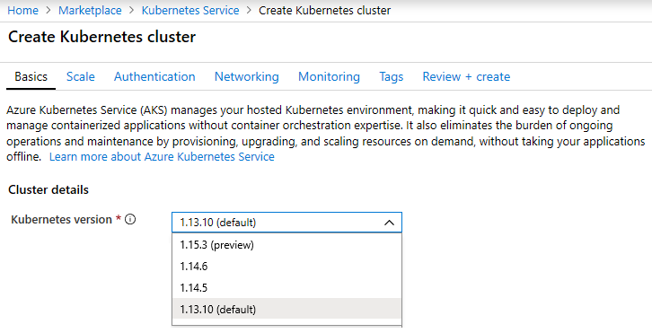
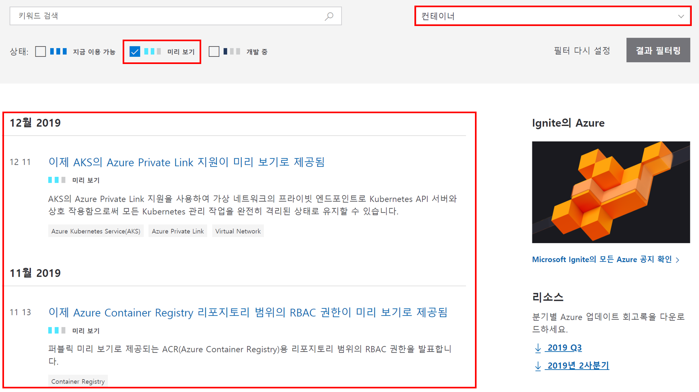

---
wts:
    title: '23 - Azure Preview 기능 액세스'
    module: '모듈 04 - Azure 과금과 지원'
---

# 23 - Azure Preview 기능 액세스

이 연습에서는 Azure Preview 서비스 또는 기능에 액세스하고 최신 Azure 업데이트 정보를 확인합니다.

실습 시간: 10 분

# 실습 1: Preview 서비스와 기능 액세스

이 실습에서는 마켓 플레이스의 Preview 기능을 확인합니다.

1. <a href="https://portal.azure.com" target="_blank">Azure Portal</a>에 로그인 합니다.

2. 검색창에 **Marketplace**를 검색합니다. 

3. 마켓플레이스 검색창에 **Preview**를 검색하고 관심 있는 Preview 제품을 모두 검토합니다.

4. 마켓플레이스 검색창에 **Kubernetes Service**를 검색하고 **만들기** 버튼을 클릭합니다.

5. **Kubernetes 버전**의 드롭다운 메뉴를 클릭하면 **Preview** 버전이 있을 수 있습니다. 모든 서비스에 Preview 버전이 있지 않으며 Kubernetes Service에도 Preview 버전이 없을 수 있습니다.

    

    **메모**: 프로덕션에서 Azure 서비스를 사용하는 경우, 일반적으로 사용 가능한 Azure 서비스나 제품 내에서 미리보기 기능은 아직 프로덕션 배포에 적합하지 않을 수 있습니다. 또한 프로덕션 환경에 배포하기 전에 사용에 대한 제한 사항을 알고 있어야 합니다.

# 실습 2: Azure 업데이트 페이지 검토

이 실습에서는 Azure 업데이트 페이지를 검토합니다.

1. 브라우저에서 <a href="https://azure.microsoft.com/ko-kr/updates/" target="_blank">Azure 업데이트</a> 웹페이지를 탐색합니다.

2. **지금 이용 가능**, **미리 보기**, **개발 중** 체크 박스 옵션이 있으며 필요한 정보만 체크하여 확인할 수 있습니다.

3. **미리 보기** 체크 박스에 체크를 한 후 **범주별 찾아보기** 드롭 다운 메뉴에서 **컨테이너**를 선택한 후 **결과 필터링** 버튼을 클릭합니다. 컨테이너 서비스 중 Preview인 서비스만 볼 수 있습니다.

    

4. 결과 목록에서 항목을 클릭하여 더 자세한 정보를 확인합니다.

5. **Azure 업데이트** 페이지로 돌아가 **지금 이용 가능**만 선택한 후 결과 필터링을 합니다. 출력된 결과 중 관심 있는 항목을 클릭하여 자세한 정보를 확인합니다.

6. **Azure 업데이트** 페이지로 돌아가 **개발 중**만 선택한 후 결과 필터링을 합니다. 출력된 결과 중 관심 있는 항목을 클릭하여 자세한 정보를 확인합니다.

Azure Preview 서비스 또는 기능에 액세스하고 최신 Azure 업데이트 정보를 확인했습니다.
